<p align="center"></p>

# Waypoint Dispatch

**One delivery. Every handoff accounted for.**

Team Xception's Hackathon solution for Waypoint Group's four roles: store manager, dispatcher, loader and driver. It connects confirmed demand, explainable allocation, loading checks, offline delivery proof and independent store receipt. The team's trained Datathon models are served read-only by the model service (`ml-server/`); training them and the Datathon submission are outside this build.

<p align="center">
  <a href="https://waypointgo.live"><strong>Live demo: waypointgo.live</strong></a>
  <br>
  <a href="https://dispatcher.waypointgo.live">dispatcher</a> ·
  <a href="https://loader.waypointgo.live">loader</a> ·
  <a href="https://driver.waypointgo.live">driver</a> ·
  <a href="https://store.waypointgo.live">store</a>
  <br>
  <sub>Sign-in details for every role: <a href="#deployed-system">Deployed system</a> · see it first: <a href="#screenshots">Screenshots</a></sub>
</p>

> [!TIP]
> **Judges: start at [https://waypointgo.live](https://waypointgo.live)** with the accounts in [Deployed system](#deployed-system), then follow the [Judge walkthrough](#judge-walkthrough). Nothing needs to be installed.

## Deliverables

| Deliverable | Where |
| --- | --- |
| Deployed system and the seeded accounts | [Deployed system](#deployed-system) |
| Setup and configuration | [Run with Docker Compose](#run-with-docker-compose), [Run locally](#run-locally), [Configuration](#configuration) |
| Seeded account details | [Deployed system](#deployed-system), [Seeded accounts](#seeded-accounts) for a fresh copy |
| Judge walkthrough | [Judge walkthrough](#judge-walkthrough) |
| UI screenshots | [Screenshots](#screenshots), more in [docs/screenshots/](docs/screenshots/) |
| Departures from the Designathon submission | [Departures from the Designathon design](#departures-from-the-designathon-design), detail in [docs/design-mapping.md](docs/design-mapping.md) |
| Docker Compose file and `.env.example` | [compose.yaml](compose.yaml), [.env.example](.env.example) |
| Architecture diagram | [Architecture](#architecture) in this README: [system](docs/architecture-diagram.jpeg) and [backend modules](docs/backend-modules-diagram.jpeg); Mermaid sources in [docs/architecture.md](docs/architecture.md) |
| Data model | [Data model](#data-model) in this README: [UML data model](docs/data-model-diagram.jpeg); every table in [docs/data-model.md](docs/data-model.md) |
| AI tool disclosure | [docs/ai-disclosure.md](docs/ai-disclosure.md) |

## Deployed system

**https://waypointgo.live**

Sign in with the email and password; each account opens its own role's workspace.

| Role | Email | Password | Device |
| --- | --- | --- | --- |
| Dispatcher | `dinushabawantha@waypoint.local` | `123456789123` | desktop, 1440 px |
| Driver | `rashmikadilshan@waypoint.local` | `123456789123` | phone |
| Store manager | `ransikaj@waypoint.local` | `123456789123` | desktop or phone |
| Loader | `peliyagoda@waypoint.local` | `123456789123` | phone or tablet |
| Administrator | `admin@waypoint.local` | `Wp-rkdSfjjSWX1QzJ` (a fresh local copy: `123456789123`) | desktop |

The loader account is the Peliyagoda warehouse's shared dock device. After signing in, choose a loader and enter that loader's PIN:

| Loader | PIN |
| --- | --- |
| Isuru Sudarshana | `2468` |
| Kalindu Ranathunga | `2468` |
| Tharusha Udana | `2468` |
| Manodya Sasmini | `2468` |

Each role also has an address of its own: [dispatcher.waypointgo.live](https://dispatcher.waypointgo.live), [loader.waypointgo.live](https://loader.waypointgo.live), [driver.waypointgo.live](https://driver.waypointgo.live) and [store.waypointgo.live](https://store.waypointgo.live).

## Screenshots

From the live deployment. Every role works in one responsive web app, offline-capable for the field roles.

**Sign in.** One page for every role; after the first sign-in the app keeps working offline and syncs when the connection returns.

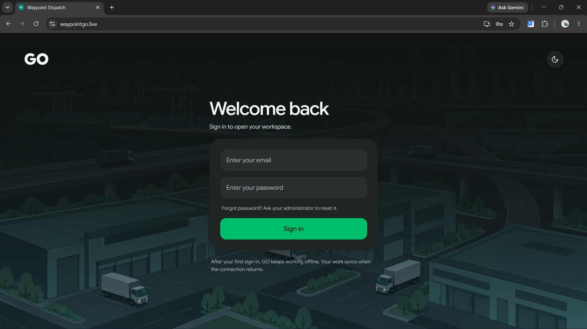

**Dispatcher.** Overview across both depots: tomorrow's plan per depot (published or draft), today's orders with deferrals, vehicles available, the last seven days, and escalated issues. Forecast: the next ten weeks of demand by brand against fleet capacity, and what the busiest days need in vehicles, reefers and drivers.

<table>
  <tr>
    <td width="50%">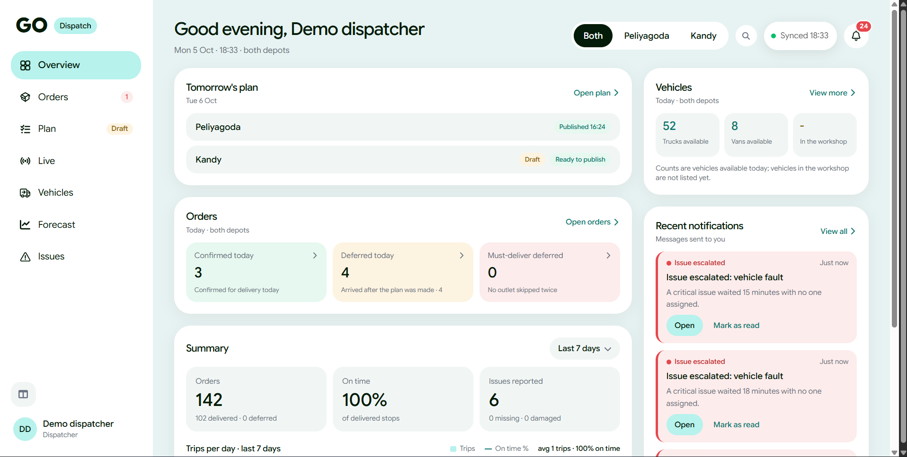</td>
    <td width="50%">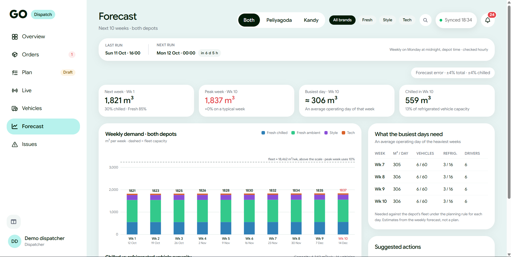</td>
  </tr>
  <tr>
    <td align="center"><sub>Overview</sub></td>
    <td align="center"><sub>Forecast</sub></td>
  </tr>
</table>

**Field roles.** The driver's phone app (vehicle, availability, published runs and notifications), the loader's shared dock tablet (pick your name, enter your PIN) and the store manager's phone (next delivery with planned arrival and progress, tomorrow's order before the 16:00 cutoff).

<table>
  <tr>
    <td width="30%" valign="top">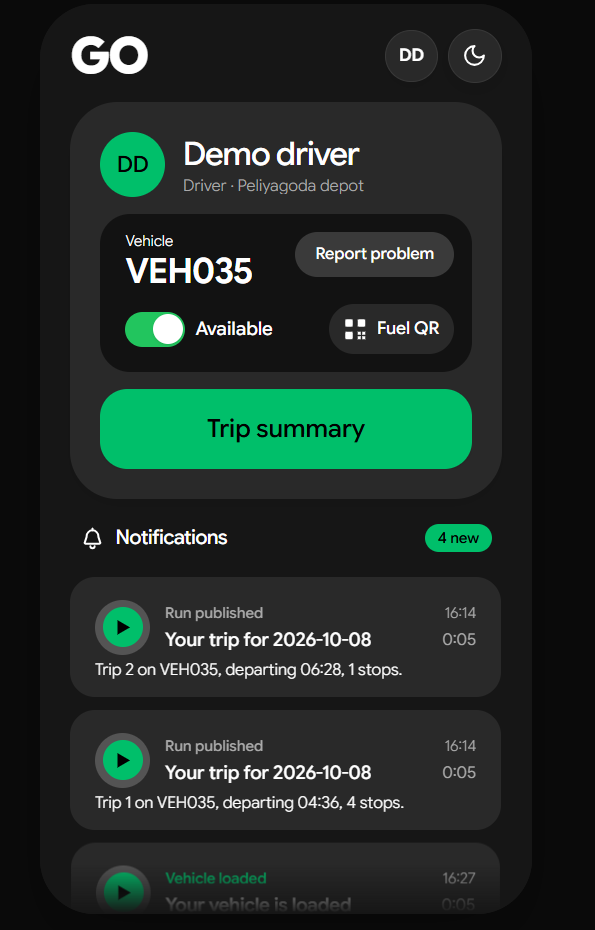</td>
    <td width="45%" valign="top">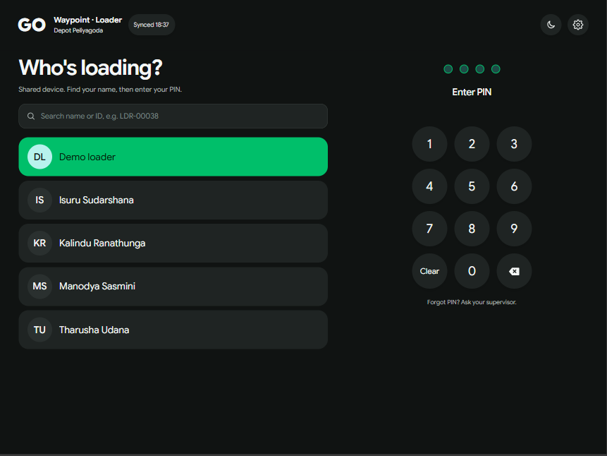</td>
    <td width="25%" valign="top">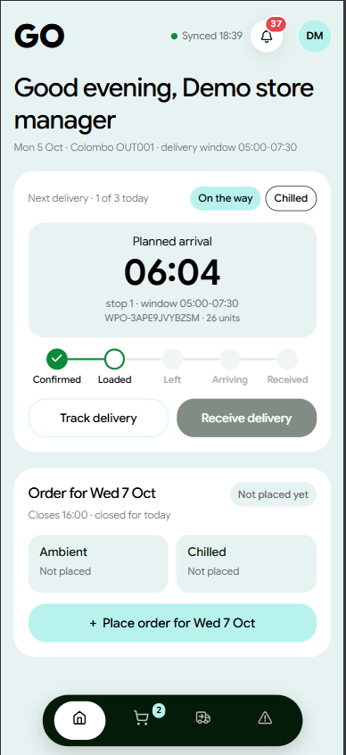</td>
  </tr>
  <tr>
    <td align="center"><sub>Driver</sub></td>
    <td align="center"><sub>Loader</sub></td>
    <td align="center"><sub>Store manager</sub></td>
  </tr>
</table>

**Administrator.** People and access: every member with their persona and scope (depot or outlet), and the personas and system roles behind them, with their permission catalogue and change history.

<table>
  <tr>
    <td width="50%">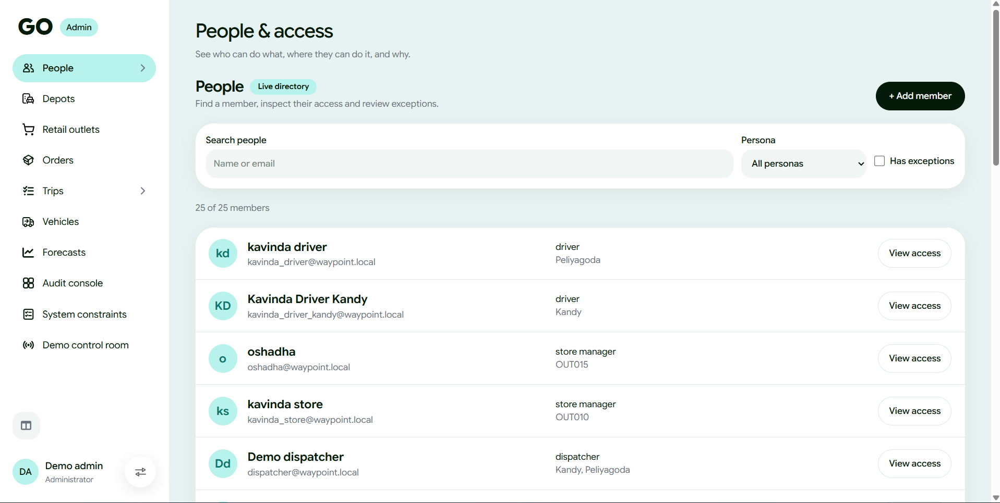</td>
    <td width="50%">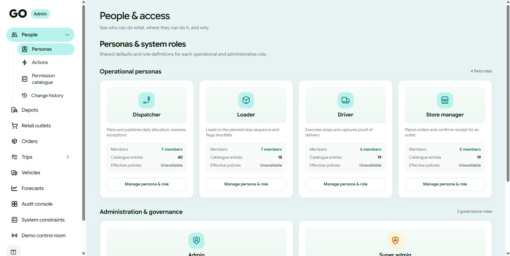</td>
  </tr>
  <tr>
    <td align="center"><sub>People</sub></td>
    <td align="center"><sub>Personas and roles</sub></td>
  </tr>
</table>

More screens at each device width are in [docs/screenshots/](docs/screenshots/).

## Repository and runtime

`dev` is the integration branch: work branches from it and merges into it, and every push to it deploys the preview. `main` is what production runs and moves by a release pull request from `dev`, so it lags `dev` between releases. The repository is [Xception-WaypointGo](https://github.com/kavindamihiran/Xception-WaypointGo).

- `frontend/`: Next.js UI, same-origin API proxy, offline storage and browser tests.
- `backend/`: Spring Boot REST API, authentication, planning, account administration and PostgreSQL access.
- `data/` and `migrations/`: tracked reference data CSVs and shared versioned SQL.
- `docs/`: architecture, deployment, design rationale and submission evidence.
- `docs/development-docs/`: how to work on the repository. Local setup, the status page and the development log.
- `docs/issues/`: one folder per GitHub issue, with the plan written before the code and the walkthrough written after.

Maven `target/` directories and compiled Java classes are ignored and are rebuilt locally.

## Tech stack

| Layer | Technology |
| --- | --- |
| Frontend | Next.js 16, React 19, TypeScript; service worker and IndexedDB write queue for offline use; Playwright browser suites |
| Backend | Java 17, Spring Boot 3.4 modular monolith (JDBC, no ORM); Argon2id passwords; ArchUnit module boundary tests |
| Planning engine | Pure Java in `planning/domain`: priority insertion, an exact refrigerated re-plan and an adaptive large neighbourhood search (ALNS) cost stage, all checked by one constraint registry |
| Database | PostgreSQL 16, one schema per module, row-level security, versioned SQL migrations |
| Model service | Python, FastAPI; the team's trained Datathon models (scikit-learn, LightGBM, XGBoost, CatBoost, statsmodels), read only |
| MCP adapter | Node, `@modelcontextprotocol/sdk`, fixed read-only calls to the backend |
| Operations | Docker Compose, nginx, Grafana, Loki, Alloy, Prometheus, OpenTelemetry tracing; GitHub Actions CI |

## Architecture

Waypoint Dispatch is a **modular monolith**: one Spring Boot process and one PostgreSQL database, split into business modules that each own one schema and are only reached through their published contract. Module boundaries are checked by the build (`ModuleBoundaryTest`, `EventCatalogueTest`), so any module can be extracted later without a rewrite. The Mermaid sources and more detail are in [docs/architecture.md](docs/architecture.md); the reasoning is in [SYSTEM-ARCHITECTURE.md](SYSTEM-ARCHITECTURE.md).

### System architecture

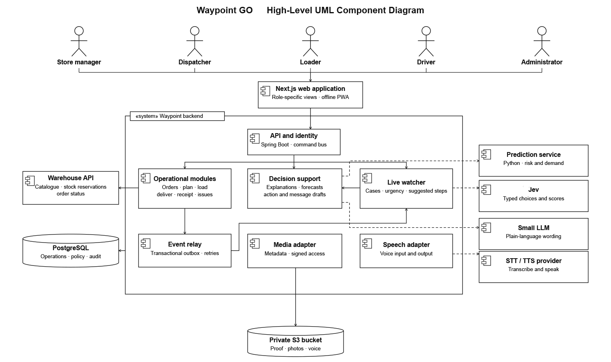

### Who uses it

```text
 Store manager ─┐
 Dispatcher ────┤  one responsive web app   ┌──────────────────────┐  StockPort, circuit breaker  ┌───────────────┐
 Loader ────────┼──────────────────────────►│   Waypoint Dispatch  │─────────────────────────────►│ Warehouse API │
 Driver ────────┤        HTTPS              │                      │                              └───────────────┘
 Admin ─────────┘                           │  web app · backend · │  Web Push, VAPID             ┌───────────────┐
 AI assistant ── MCP, read only, OAuth ────►│  PostgreSQL          │─────────────────────────────►│ Push services │
                                            └──────────────────────┘                              └───────────────┘
```

### What runs

```text
 Browser                         Docker Compose
 ┌────────────────────────┐      ┌────────────────────────────┐     ┌──────────────────────────────┐
 │ Role screens (Next.js) │HTTPS │ waypoint                   │/api │ backend                      │
 │ Service worker         ├─────►│ Next.js, same-origin proxy ├────►│ Spring Boot modular monolith │
 │ Offline queue (IDB)    │      └─────────────┬──────────────┘     └──┬──────────────┬────────────┘
 └────────────────────────┘                    │ /mcp                  │ JDBC         │ forecasts, plan scoring
                                 ┌─────────────▼──────────────┐     ┌──▼───────────┐ ┌▼──────────────────────┐
                                 │ mcp (Node, read only GETs) │     │ db           │ │ ml (FastAPI, trained  │
                                 └────────────────────────────┘     │ PostgreSQL 16│ │ Datathon models)      │
                                 init: migrate, import-reference    └──────────────┘ └───────────────────────┘
                                 observability: alloy, loki, prometheus, grafana
```

### Modules and how they connect

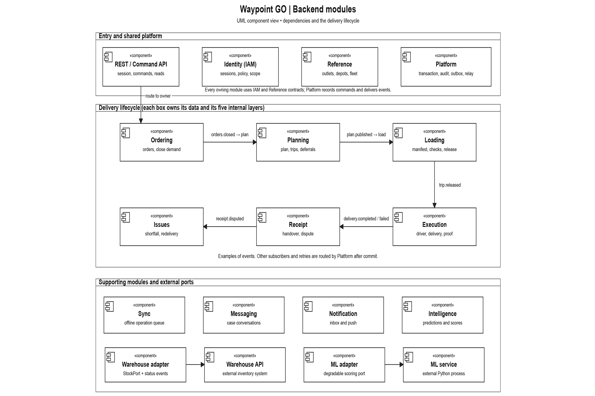

The delivery day flows left to right through events; everything else supports it.

```text
                 reads: Reference data (ref) · Identity and access (iam)
                                      │
 Ordering ──orders.closed──► Planning ──plan.published──► Loading ──trip.released──► Execution ──delivery.completed──► Receipt
    ▲    ◄──order.deferred──    │                           │                           │                              │
    │                           │ PredictionQuery           └──shortfall──► Issues ◄────┴──failed, fault───────────────┤
    │                           ▼                                             │                                        │
    │                      Intelligence                                       │ redelivery.requested                   │
    └─────────────────────────────────────────────────────────────────────────┴──────────── receipt.confirmed ─────────┘

 Supporting: Warehouse (StockPort) · Notification (all events) · Messaging (trip threads) · Sync (offline replay) · Demo
 Platform (integration schema): command bus · idempotency receipts · audit log · outbox and relay · scheduler
```

| Module | Schema | What it owns |
| --- | --- | --- |
| Reference data | `ref` | Outlets, vehicles, districts, depots, calendar, travel and service allowances, versioned |
| Identity and access | `iam` | Sign-in, sessions, versioned policies, depot and outlet scope, MCP OAuth |
| Ordering | `ordering` | Order capture, the 16:00 cutoff, the order lifecycle |
| Warehouse | `warehouse` | The anti-corruption layer to the external stock API |
| Planning | `planning` | Allocation, deferrals, the engine chain, publication and revisions ([How planning works](#how-planning-works)) |
| Loading | `loading` | Dock checks against the stop order, shortfalls, vehicle interchange |
| Execution | `execution` | Stops, arrivals, proof of delivery, positions, offline from the driver's phone |
| Receipt | `receipt` | The store's independent confirmation or dispute |
| Issues | `issues` | One lifecycle for every problem, with escalation |
| Notification | `notification` | In-app and Web Push messages from events, tracked per channel |
| Messaging | `messaging` | One thread per trip, with voice notes |
| Sync | `sync` | Offline commands replayed exactly once, conflicts shown |
| Intelligence | `ml` | Forecasts, late risk and attention, outside the transactional core |
| Demo | `demo` | Opt-in judge scenarios and simulated vehicles |

Modules talk in three ways only: a **domain event** through the outbox, a **read** of another module's contract, or a **port** to anything outside the process.

### Inside a module

Every module has the same five packages, and dependencies point inward:

```text
 ┌───────────────────────────────────────────────────────────────────────────┐
 │ contract        views · queries · commands · events                       │ ◄── the only package
 │                                                                           │     other modules import
 ├───────────────────────────────────────────────────────────────────────────┤
 │ web             thin controllers and reads                                │
 ├───────────────────────────────────────────────────────────────────────────┤
 │ application     handlers · queries · consumers · jobs                     │
 │                 the only layer that opens a transaction or authorizes     │
 ├──────────────────────────────────────┬────────────────────────────────────┤
 │ domain                               │ infrastructure                     │
 │ pure rules and state machines        │ JDBC repositories · ports          │
 │ no Spring · no SQL · no clock        │ depends on domain                  │
 └──────────────────────────────────────┴────────────────────────────────────┘
```

### One command, end to end

```text
 client or offline queue ──POST /api/commands (command id, expectedVersion)──► CommandBus
   CommandBus: policy AND scope, else 403 and audit
   ┌─ one transaction ───────────────────────────────────────────────────────────────┐
   │ idempotency receipt (seen before? answer from it) → handler → row_version check │
   │ → change + outbox event + audit row + receipt                                   │
   └─────────────────────────────────────────────────────────────────────────────────┘
   ◄── ack, or RFC 9457 problem naming every failed rule (stale version is 409)
 afterwards, at least once: outbox relay (SKIP LOCKED) → each subscriber in its own transaction
```

### Data model

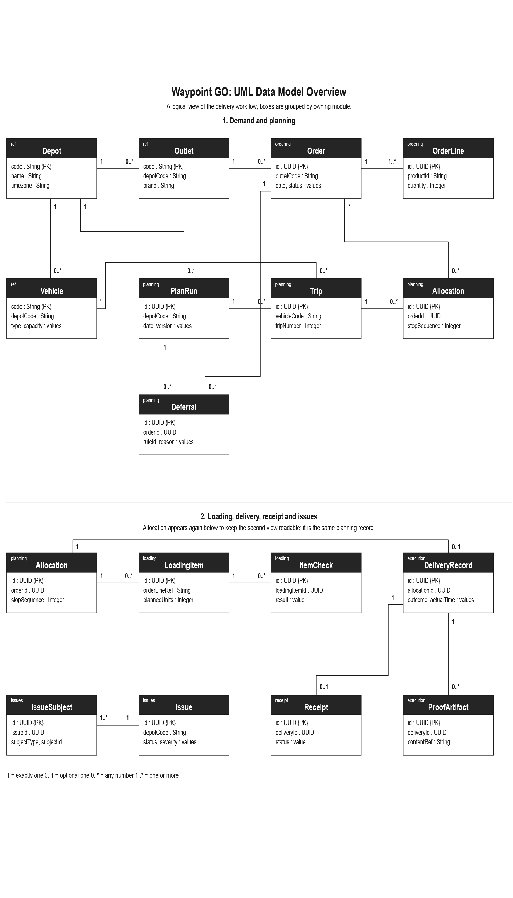

A logical view of the delivery workflow, grouped by owning module: demand and planning (depot, outlet, vehicle, order, plan run, trip, allocation, deferral), then loading, delivery, receipt and issues. Modules link by id and by event; foreign keys point only into `ref` and `iam`. Every table, key and foreign key is in [docs/data-model.md](docs/data-model.md), generated from the live migrations.

## How planning works

The dispatcher presses **Generate draft** and a queued job runs the engine outside any database transaction. The engine is a chain, wired in [PlanningEngineConfiguration.java](backend/src/main/java/com/waypoint/dispatch/planning/infrastructure/PlanningEngineConfiguration.java):

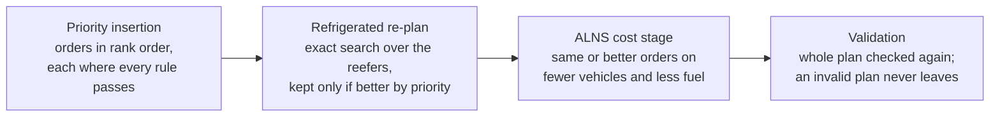

1. **Priority insertion** (`PriorityInsertionEngine`) ranks orders by the versioned priority table (outlets skipped yesterday, Fresh, chilled, strict access, earliest closing window) and places each one where weight, volume, temperature, `van_only` access, delivery and mall windows, weekly fuel and the two-trip limit all pass.
2. **Refrigerated re-plan** (`ScarceFleetReplan`) plans the scarce reefers again as a whole and keeps the result only when it serves a better set by priority.
3. **ALNS cost stage** (`CostReplan`) runs on a day that deferred something or has trips under 85% full on average. Each of 2,000 iterations removes orders (random, a whole vehicle, part of a district or the emptiest trip) and puts them back in rank order through the same constraint registry. A plan wins by priority first, then fewer vehicles, then fewer litres, so cost never trades priority. It is seeded from the orders, so the same day always gives the same plan, and the rules plan is kept beside it in **Compare**.
4. **Validation** (`ValidatingEngine`) re-checks every trip of both plans. Every order ends served, deferred with the rule that stopped it, or unservable.

The dispatcher can then place, swap, lock, keep deferred, edit a trip or reorder stops, and each change is checked against the same rules.

**Why this engine.** It was chosen by measurement: 8 engine variants, including an exact MIP as the proof, on 62 days (the official peak day, the 8 historic depot-days with 0, 25 and 40% of the fleet out, and generated days up to 300 orders), 435 runs, every plan judged by the production checker. See the [benchmark notebook](docs/issues/219-planning-v2/benchmark/planning-benchmark.ipynb), its [results](docs/issues/219-planning-v2/benchmark/results-all.csv) and the [issue #219 walkthrough](docs/issues/219-planning-v2/WALKTHROUGH.md).

| Result | Before (stages 1 and 2) | Production (all stages) |
| --- | --- | --- |
| Days best by priority (of 62) | 30 | 58 |
| Orders served, all days | 5,103 | 5,464 |
| Vehicles, all days | 1,137 | 954 |
| Peak day: served, vehicles, litres | 73, 16, 725 | 73, 13, 611 |

On the 34 days where the MIP proved the best set of orders, production serves exactly that set. Against stages 1 and 2 alone it uses a median 23% less fuel. The peak-day output passes the official `check_allocation.py` in CI.

## Run with Docker Compose

The complete stack (PostgreSQL, the backend, the model service, the frontend and the seed data) starts with one command. It needs Docker Engine 24+ with Compose v2, and Git LFS for the trained model files:

```sh
git clone https://github.com/Dinusha-Ekanayake/Xception-WaypointGo.git
cd Xception-WaypointGo
git lfs pull                # the trained model files
cp .env.example .env        # SEED_PASSWORD in it is the password of every seeded account
docker compose up --build
```

The one-shot `init` service runs `migrate`, `import-reference`, `demo-accounts` and `seed-delivery-day` against the fresh database. Each step is idempotent, so a restart changes nothing that is already there. Then open http://localhost:3000 and sign in with any account under [Seeded accounts](#seeded-accounts). Health is at http://localhost:8080/health/readiness and metrics at http://localhost:8080/prometheus.

`.env.example` sets `SEED_PASSWORD=123456789123`, and every seeded account is created with it on the first start, so a fresh copy signs in with the same emails and password as the [deployed system](#deployed-system). Compose uses the same value when there is no `.env` at all. Changing it later does not change existing accounts; set a private value before exposing an instance.

## Run locally

For day-to-day work PostgreSQL runs in Docker and the application runs natively. It needs Node.js 22.13+, Java 17+ with Maven, and Docker for the database.

```sh
cp .env.example .env
scripts/dev.sh setup        # once: database, migrations, reference data, demo accounts, npm ci
scripts/dev.sh              # every time: database, backend on 8080, frontend on 3000
```

Then open http://localhost:3000. `scripts/dev.sh` always uses the local Docker database, never the `DATABASE_URL` in `.env`. The same steps by hand:

```sh
docker compose up -d db                 # PostgreSQL on 127.0.0.1:5432
cd backend && mvn spring-boot:run       # second terminal; needs DATABASE_URL exported, Spring does not read .env
cd frontend && npm ci && npm run dev    # third terminal; reads BACKEND_URL from frontend/.env.local
```

The details, and which process reads which configuration file, are in [development.md](docs/development-docs/development.md). Production deployment is in [deployment.md](docs/deployment.md).

## Seeded accounts

`docker compose up` creates one account per role, all with the password in `SEED_PASSWORD` (`123456789123` unless you change it). These are the accounts of a fresh copy; the deployed system's accounts are under [Deployed system](#deployed-system).

| Role | Email | Scope after the seed | Device |
| --- | --- | --- | --- |
| Dispatcher | `dispatcher@waypoint.local` | Peliyagoda depot | desktop, 1440 px |
| Loader | `loader@waypoint.local` | Peliyagoda depot; dock PIN `DEMO_LOADER_PIN` (default `2468`) | phone or tablet |
| Driver | `driver@waypoint.local` | Peliyagoda depot; every Peliyagoda vehicle on the seeded day | phone |
| Store manager | `store_manager@waypoint.local` | outlet `DEMO_OUTLET` (default `OUT001`, Waypoint Fresh, Colombo) | desktop or phone |

`admin@waypoint.local` and `auditor@waypoint.local` exist too, with the same password, but are not part of the walkthrough. Locally every role is on http://localhost:3000.

`docker compose up` also creates the deployed system's named accounts from [scripts/demo-accounts.csv](scripts/demo-accounts.csv), with the same `SEED_PASSWORD`: the dispatcher, driver, store manager and `peliyagoda@waypoint.local` listed under [Deployed system](#deployed-system), and the four loaders with PIN `2468` ([scripts/seed-demo-accounts.sh](scripts/seed-demo-accounts.sh)). [scripts/seed-demo.sql](scripts/seed-demo.sql) then gives the named store manager the seeded outlet `OUT001` and the named driver the seeded day's vehicles (a vehicle has one driver a day, so `driver@waypoint.local` keeps none). The walkthrough below uses these named accounts, on the deployed system and in a local copy alike. If the first start stops at `init`, run `docker compose up` again: the second start completes.

## Judge walkthrough

The seed places the Task 2B peak day: 85 confirmed Peliyagoda orders across all three brands on the first operating day still open for ordering, with the scenario's 10 workshop vehicles out. That is more than the fleet can carry, so the plan has to defer orders. Open the driver and loader at phone width (for example 393 px in the browser's device toolbar).

1. **Store manager: see the order.** Sign in as `ransikaj@waypoint.local`. Home and Orders show OUT001's two orders for the seeded day (one ambient, one chilled), confirmed and waiting to be planned.
2. **Dispatcher: one queue.** Sign in as `dinushabawantha@waypoint.local` and open **Orders**. Every order due at Peliyagoda that day is in one table with its brand, temperature and status. **Close orders** is accepted only after the 16:00 cutoff the day before (R-ORD-01); before then the screen shows the refusal and its rule, and planning still works.
3. **Dispatcher: plan the peak day.** Open **Plan**. It opens on today; when nothing waits today it names the seeded day, so choose **Plan** for that day, then **Generate draft**. The engine allocates against weight and volume limits, refrigerated vehicles for chilled goods, vans for `van_only` outlets, delivery and mall windows, weekly fuel and at most two trips per vehicle, then plans the refrigerated vehicles again as a whole and keeps the result only if it is better by priority, then runs the ALNS cost stage to carry the same orders on fewer vehicles and less fuel ([How planning works](#how-planning-works)); the plan says what each pass changed, and **Compare** opens the rules-only plan beside it. On the seeded day 73 of 85 orders are placed on 13 vehicles (16 without the cost stage), 11 are deferred, and one order is larger than any vehicle and cannot be served.
4. **Dispatcher: explain the deferrals.** In **Decide**, each order the plan could not place shows the rule that stopped it. Open one to see where it could go; only feasible places can be chosen, and a manual placement needs a reason. In **View plan**, open a trip to see its load against capacity, departure and stop order; **Take off** defers an order with a reason.
5. **Dispatcher: publish.** **Publish** lists what the plan leaves undelivered, then **Publish plan**. **Vehicles** shows each vehicle's planned fuel against its weekly quota, and Overview lists outlets skipped on earlier runs.
6. **Loader: load in stop order.** Sign in as `peliyagoda@waypoint.local`, choose a loader and enter PIN `2468` on the dock screen. The dock board lists the published trips: it shows the first day, from today, with a trip still to load, so on the evening before (or a weekend before Monday's run) it is the seeded day's. Open the trip that carries OUT001: items are listed in reverse stop order, so the first stop is loaded last. Check items off one by one.
7. **Loader: flag a shortfall (degradation).** Mark one item short by a unit, or missing or damaged. The shortfall is recorded before departure and reaches the dispatcher's **Issues** inbox. Complete the release checklist and **release** the trip.
8. **Driver: follow the run.** Sign in as `rashmikadilshan@waypoint.local`. Home shows the vehicle, the run's stop count (today's, or the first day within the next week with a released trip, so on install day the seeded day's) and the driver's notifications (plan published, trip released). **Start trip** opens the run sheet: the next stop with its expected arrival, window and units, and the other stops in order.
9. **Driver: deliver with no signal (degradation).** In the browser's developer tools set the network to Offline. At OUT001 tap **I've arrived**, then **Open delivery report** and **Record delivery**, and record the delivery with receiver name, count, photo and signature. If a unit was short at loading, record a partial delivery: the screen asks what happened to the goods that did not arrive. The record is kept on the phone and the screen says it is waiting to sync. Reload the page: it is still there. Set the network back to Online and the queue drains on its own; the server applies each record once.
10. **Dispatcher: watch progress.** **Live** lists vehicles most urgent first, with the delivered stop and anything that still needs the dispatcher.
11. **Store manager: confirm receipt.** Back as the store manager, the delivery shows as arrived. **Receive this delivery**, confirm what arrived per item, or report a problem (missing, damaged, wrong item) with a photo. The report reaches the dispatcher's **Issues** inbox, where it can be taken, resolved and closed. The answer shows a four-digit handover PIN; the driver can enter it from **Enter store manager PIN** after saving the delivery, as evidence the two met. A wrong PIN says how many tries are left, and skipping it never holds the delivery up.

To start again from an empty database: `docker compose down -v && docker compose up --build`.

## Departures from the Designathon design

The Figma file (pages 04 to 17) is the specification. Where the design shows something no backend module provides yet, it is left out rather than faked. Updated 2026-10-05:

- **Driver:**
  - Vehicle pick-up by QR code is not built (dispatch assigns the vehicle).
  - Fuel QR shows the vehicle's fuel pass, which an administrator sets on the vehicle (admin console, Vehicles, Fuel pass) and the driver assigned to the vehicle that day sees, also with no signal. Fuel logging and calls have no backend.
  - The map is the run's own trail and next stop. It hands off to the phone's maps app only for an exact store location.
  - With no released trip today, Home names the next trip ahead and says it is waiting for the loader. The design shows only a released run.
  - English only.
- **Dispatcher:**
  - Global search (the header, `/` or Ctrl+K) looks through what the screens have already loaded for the day and the depots in view: orders, vehicles, trips, issues and depots. It does not search other days.
  - In Plan, **Explain this plan** and, on a deferred order, **Explain this decision** open a pop-up that sets out what the plan carries, why orders were left off, what was checked and what can be done, from the facts the plan already holds. The plan's explanation also opens by itself when a plan is generated, and each order in the plan view's Deferred list has a question mark that opens its own. The design shows the reason on the panel only.
  - The explanations are rule-based. Where the deployment sets `GROQ_API_KEY`, a language model also rewords each one more naturally, shown above the facts and marked as AI-worded. It is given only the facts of that plan or order, is asked once and then reused, and is dropped if it names a figure the facts do not hold. Without the key nothing leaves the system.
  - On Live, each item under "Needs you" has **Suggested steps**: the steps for that situation and a message already written with the vehicle and the store, opened in the trip's messages for the dispatcher to send. The steps are fixed in the app for now; an administrator cannot edit them yet.
  - Vehicle interchange approval waits on Loading.
  - The Forecast's error chip shows the demand model's measured error over all volume and over chilled volume. The design shows a figure per brand, which the model does not measure.
  - Late risk is shown only on a published plan, once the time predictor has scored it. A draft says it is scored once published, and an estimate says so.
  - On the live map, a depot's name reads "Peliyagoda depot" where the design writes "Peliyagoda Warehouse": the glossary keeps "warehouse" for the external stock system. A chosen vehicle's run path, from its trip's start to the truck, is drawn only while it is chosen.
- **Loader:**
  - Vehicle interchange and dispatcher handover are not built.
  - When the trips on the board leave after tomorrow (a weekend), "Tonight's departures" names the day they leave.
  - Sinhala and Tamil are drafts awaiting a native speaker.
- **Store manager:**
  - Call options are not built; a delivery's Message is used instead.
  - Draft orders are not built.
  - The Next delivery card shows the driver and a predicted arrival once the trip leaves. Before that, it shows the next planned or confirmed delivery and the outlet's window.
  - Below 440 px the header hides the Store chip and uses smaller round buttons so the sync time fits. The bottom bar stays icon-only, as designed.
- **All roles:**
  - On a phone, the main action of a long form (the driver's Confirm and Save proof, the store's receipt) stays pinned at the bottom of the screen while the form scrolls under it.
  - Notifications arrive in every role's screens with a live count.
  - Push to a closed phone works only where the server has VAPID keys, and says so otherwise.
  - Messages (with voice notes) are per trip; threads for issues and orders are not built.

Role by role detail is in [design-mapping.md](docs/design-mapping.md).

## Backend commands

The backend jar serves by default. Operational commands run explicitly, never as a side effect of a build or a request:

| Command | Does | Needs |
| --- | --- | --- |
| `migrate` | Applies pending SQL in `migrations/`, atomically, under an advisory lock | `DATABASE_URL` |
| `import-reference` | Stages, validates and publishes the CSVs in `data/` as a reference version; identical content is a no-op | `DATABASE_URL`, `DATA_DIR` |
| `account-create` | Creates one account; an existing email is left unchanged | `ACCOUNT_EMAIL`, `ACCOUNT_NAME`, `ACCOUNT_PASSWORD`, `ACCOUNT_ROLE` |
| `account-grant-depot` | Grants an account a depot scope | `ACCOUNT_EMAIL`, `ACCOUNT_DEPOT` |
| `operator-pin` | Sets a loader's four-digit PIN and badge for shared dock devices | `OPERATOR_EMAIL`, `OPERATOR_PIN`, optional `OPERATOR_EMPLOYEE_CODE` |
| `loading-fixture` | Development only: builds a depot-day's loading manifests from confirmed orders without a published plan | `LOADING_FIXTURE_ENABLED=true`, `--depot` and `--date` (or `LOADING_DEPOT`, `LOADING_DATE`) |
| `demo-accounts` | Creates `<role>@waypoint.local` for each role and grants the depot roles a depot; existing accounts are left unchanged | `SEED_PASSWORD`, optional `DEMO_DEPOT` |
| `seed-delivery-day` | Places the Task 2B peak day (85 Peliyagoda orders, more than the fleet can carry) as confirmed orders on the first open operating day, marks its 10 workshop vehicles out, and grants `store_manager@waypoint.local` the outlet `DEMO_OUTLET`. Runs once per database; `docker compose up` runs it | optional `DEMO_OUTLET` (default `OUT001`) |

Commands can be combined in one run, which starts the application once: `migrate import-reference demo-accounts`. They always run in that order.

Roles: `admin`, `dispatcher`, `loader`, `driver`, `store_manager`, `auditor`. Every later account change is a command through `POST /api/commands`.

## Configuration

Typed and validated in `backend/.../platform/config/AppProperties`; the process refuses to start when misconfigured. The full list, with defaults, is `backend/src/main/resources/application.properties` and [.env.example](.env.example). The ones you are most likely to set:

| Variable | Meaning |
| --- | --- |
| `DATABASE_URL` | Required. May point at a database that is down: that is an outage, not a misconfiguration |
| `MIGRATION_DATABASE_URL` | The owner's connection, read only by `migrate`. Unset, `DATABASE_URL` does both. Set, `DATABASE_URL` must log in as `waypoint_app` |
| `COOKIE_SECURE` | On by default. `0` only for local development over plain HTTP |
| `ALLOWED_ORIGINS` | Extra origins a state-changing request may come from. Usually empty |
| `LOG_FORMAT` | `ecs` for JSON logs (set in both compose files) |
| `OTLP_EXPORT`, `OTLP_ENDPOINT`, `TRACE_SAMPLE` | Trace export, off unless both of the first two are set |
| `SESSION_ABSOLUTE_LIFETIME`, `SESSION_IDLE_LIFETIME` | Default `12h`, `2h` |
| `LOGIN_MAX_FAILURES`, `LOGIN_ADDRESS_MAX_FAILURES`, `LOGIN_IDENTITY_MAX_FAILURES`, `LOGIN_THROTTLE_WINDOW` | Default `8`, `40`, `40`, `15m` |
| `MAX_BODY_BYTES` | Default 4 MiB |
| `WAREHOUSE_BASE_URL`, `WAREHOUSE_API_KEY` | External warehouse API; the key never reaches a browser |
| `LOADING_DOCKS_PER_DEPOT` | Docks Loading spreads a depot's trips over, default `4` |
| `LOADING_FIXTURE_ENABLED` | `true` only in development, to allow `loading-fixture` |

## Verification

```sh
cd backend && mvn verify             # unit, architecture and integration tests
cd frontend && npm test              # frontend boundary and role logic tests
cd frontend && npm run typecheck && npm run build
cd frontend && npm run test:e2e      # browser tests of the shell, after npm run build
cd frontend && npm run verify        # all of the above except e2e

# one browser suite per role, against a production build with a mocked API
cd frontend && npx playwright test -c playwright.dispatcher.config.ts
cd frontend && npx playwright test -c playwright.driver.config.ts
cd frontend && npx playwright test -c playwright.loader.config.ts
cd frontend && npx playwright test -c playwright.store.config.ts
```

Integration tests use `TEST_DATABASE_URL` when it is set, a throwaway PostgreSQL 16 container when Docker is available, and are skipped with a stated reason otherwise. The bundled Testcontainers cannot talk to Docker Engine 29, so there set `TEST_DATABASE_URL` to a PostgreSQL 16 container started by hand. `TEST_DATABASE_URL` must name a dedicated database, never the application one. CI (`.github/workflows/checks.yml`) runs the backend tests, the typecheck, `npm test`, the build and the browser suites (the shell and every role) on every pull request to `dev` and `main`, and before every deploy.

## Documentation

**Start here.** Four questions, four documents:

| Question | Document |
| --- | --- |
| **What are we building, and why this shape?** | [SYSTEM-ARCHITECTURE.md](SYSTEM-ARCHITECTURE.md) |
| **What is built, what is left, and what do I pick up?** | [docs/development-docs/STATUS.md](docs/development-docs/STATUS.md) |
| **Why did it change, and what did that leave open?** | [docs/development-docs/development-log.md](docs/development-docs/development-log.md), one file per person in `log/` |
| **What is the base that must not change?** | [docs/architecture/FOUNDATION-PLAN.md](docs/architecture/FOUNDATION-PLAN.md), complete |

`SYSTEM-ARCHITECTURE.md` sits at the root on purpose: it is the entry point, the way `README.md` is. `docs/architecture/` holds the detail behind it.

**The picture first:**

- [docs/architecture.md](docs/architecture.md), the diagrams: who uses the system, what runs, how the thirteen modules connect, and one command end to end
- [docs/data-model.md](docs/data-model.md), every table, key and foreign key by schema, generated from the live migrations by `scripts/data-model.py`

**The design, in `docs/architecture/`:**

- [MODULES.md](docs/architecture/MODULES.md), every module: its layers, owned data, commands, events, invariants and failure modes
- [RULES-AND-POLICIES.md](docs/architecture/RULES-AND-POLICIES.md), every operational rule with its source and status, and the conflicts between sources
- [ASSUMPTIONS.md](docs/architecture/ASSUMPTIONS.md), what we treat as true but have not proved, plus the parameter register
- [EDGE-CASES.md](docs/architecture/EDGE-CASES.md), each case with its behaviour, enforcement point, detection signal and test
- [GLOSSARY.md](docs/architecture/GLOSSARY.md), one word per concept on every screen, each taken from a field in the data
- [DATA-MODEL-REVIEW.md](docs/architecture/DATA-MODEL-REVIEW.md), the schema findings and the corrected model
- [schema/](docs/architecture/schema/README.md), the target schema design, superseded for `ref` and `iam` by the live `migrations/`

**Working on the repository, in `docs/development-docs/`:**

- [STATUS.md](docs/development-docs/STATUS.md), every module and screen: built, partial or not started, what is left, and what to pick up next
- [development.md](docs/development-docs/development.md), local setup: PostgreSQL in Docker, the application native
- [docs/issues/](docs/issues/), per issue: `PLAN.md` before the code and `WALKTHROUGH.md` after it, the best way into a module you did not build
- [AGENTS.md](AGENTS.md), the rules a change is reviewed against
- [development-log.md](docs/development-docs/development-log.md), what changed and why: the index of `log/<github-user>.md`, one file per person, newest first

**Submission material, in `docs/`:** [design rationale](docs/design-rationale.md), [design mapping](docs/design-mapping.md), [AI disclosure](docs/ai-disclosure.md), [deployment](docs/deployment.md), [verification](docs/verification.md) and the [submission checklist](docs/submission-checklist.md).

The application and supporting documents do not constitute an uploaded competition entry. Public deployment, design-file export, video recording/upload and form submission remain team actions.
