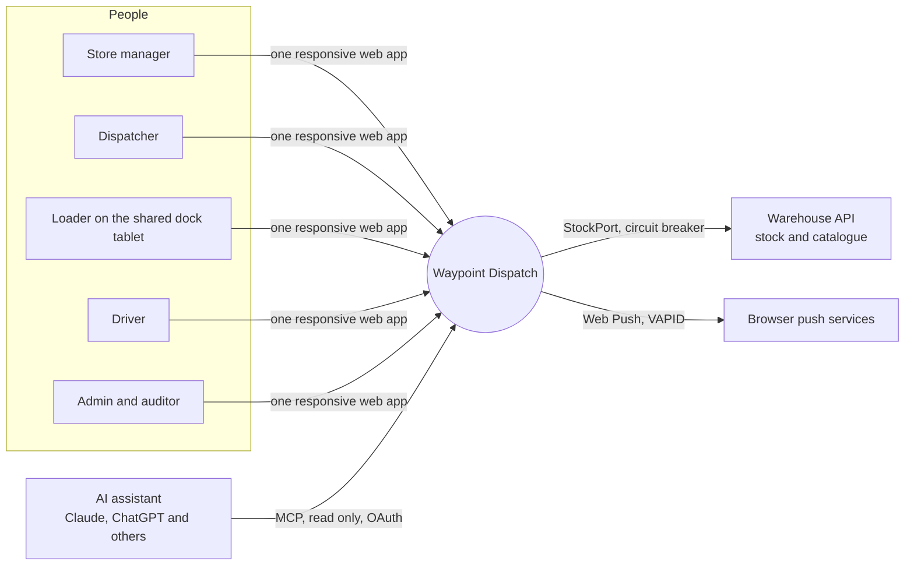
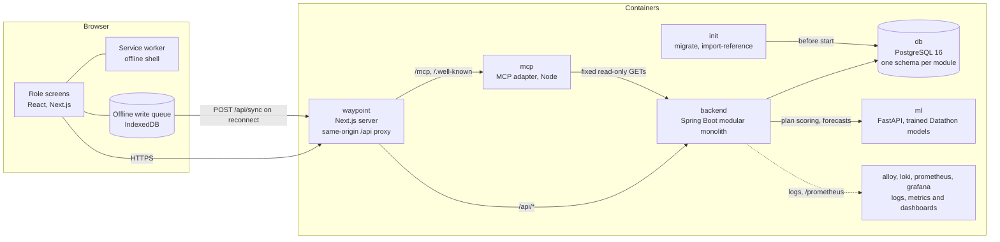
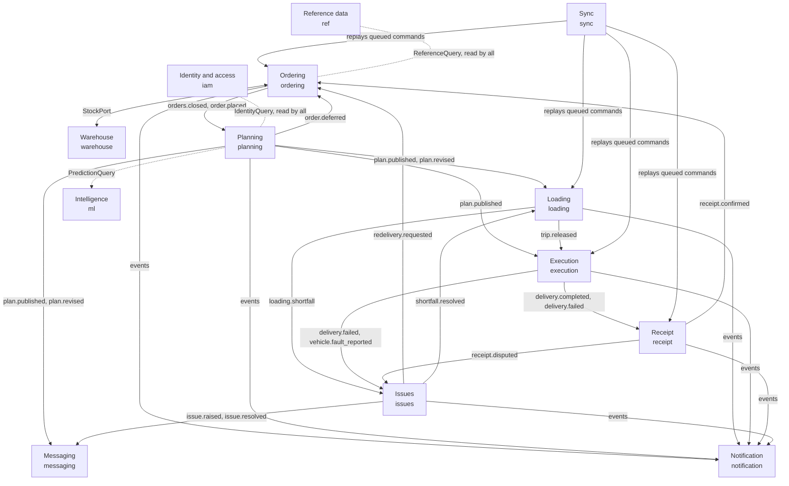
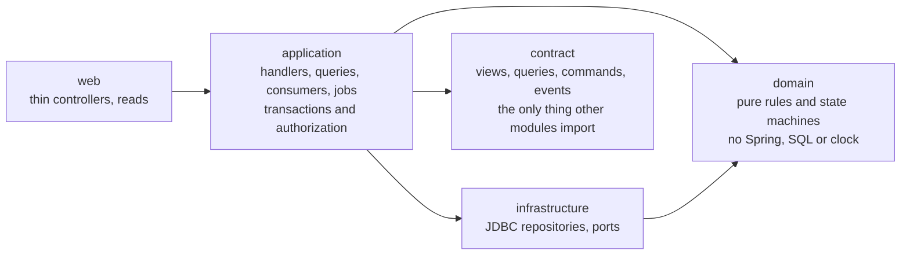
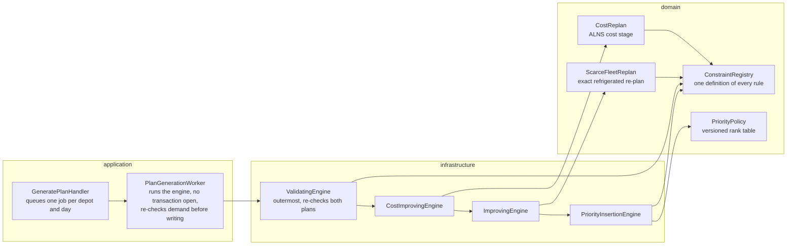
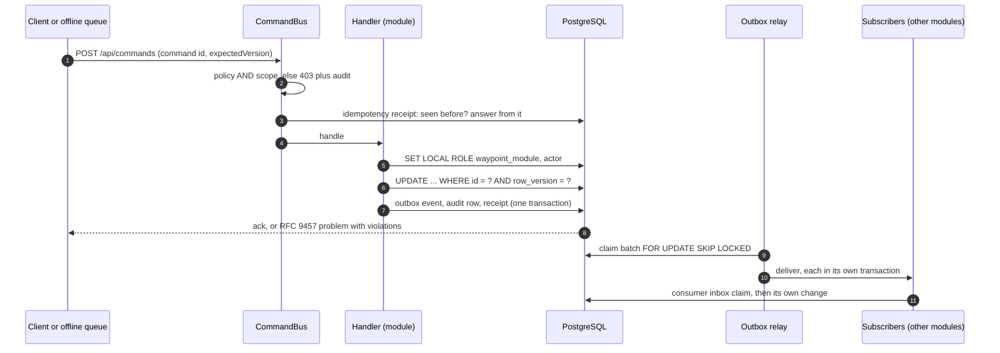

# Architecture

Waypoint Dispatch is one web application for four field roles, served by a modular monolith over one PostgreSQL database. This page draws what is built and deployed today. The system and backend module diagrams are [architecture-diagram.jpeg](architecture-diagram.jpeg) and [backend-modules-diagram.jpeg](backend-modules-diagram.jpeg); each section below has its Mermaid source; the reasoning and the target design are in [SYSTEM-ARCHITECTURE.md](../SYSTEM-ARCHITECTURE.md), each module's contract in [MODULES.md](architecture/MODULES.md), and every table in [data-model.md](data-model.md).

## Who uses it and what it talks to

Each role sees its own screens; the server decides what each person may do (policy) and which rows they may see (scope). An AI assistant connects as a person, with that person's policy and scope and nothing more ([R-IAM-30](architecture/RULES-AND-POLICIES.md)).

## What runs

The judge path, `docker compose up` with [compose.yaml](../compose.yaml):

- **Offline is tiered by role** ([tiers.ts](../frontend/src/shared/offline/tiers.ts)): the driver works fully offline, the loader and store manager are resilient to drops, the dispatcher is online only.
- **Builds and requests never migrate or seed.** `init` runs `migrate` and `import-reference` once, explicitly.
- **Production** puts nginx with TLS in front of the same services; the managed-database and single-VPS variants are in [deployment.md](deployment.md).

## Modules and how they connect

Thirteen business modules in one process, each owning one schema, plus the platform (command bus, outbox, audit, scheduler in `integration`) and an opt-in `demo` module that drives the judge scenarios. They connect in three ways only: a domain event through the outbox, a read through another module's published contract, or a port for anything outside the process.

Solid arrows are events (asynchronous, at least once, consumers idempotent); dotted lines are contract reads. The full catalogue of events with producers and consumers is in [MODULES.md](architecture/MODULES.md#module-connection-summary). Boundaries are enforced by `ModuleBoundaryTest` and `EventCatalogueTest`.

## Inside a module

## The planning engine

Planning shows the layers at work. The engines are pure domain code; the infrastructure layer chains them as decorators behind the `AllocationEngine` port, and the application layer runs the chain as a queued job outside any transaction.

The same `ConstraintRegistry` is read by the dispatcher's manual edits and the publication gate, so no path can break a rule the engine keeps. Why this chain, measured against an exact MIP on 62 days: [benchmark notebook](issues/219-planning-v2/benchmark/planning-benchmark.ipynb) and [issue #219 walkthrough](issues/219-planning-v2/WALKTHROUGH.md).

## One command, end to end

Every write goes through one path, whether it was sent online or replayed from the offline queue.

A refused rule comes back as `application/problem+json` naming every rule that failed; a stale `expectedVersion` is `409`, never a silent overwrite.

## Where to read more

| Question | Document |
| --- | --- |
| Why these choices | [SYSTEM-ARCHITECTURE.md](../SYSTEM-ARCHITECTURE.md) |
| What each module owns, its commands and events | [architecture/MODULES.md](architecture/MODULES.md) |
| Every table and key | [data-model.md](data-model.md) |
| Every rule and where it is enforced | [architecture/RULES-AND-POLICIES.md](architecture/RULES-AND-POLICIES.md) |
| Every edge case and its test | [architecture/EDGE-CASES.md](architecture/EDGE-CASES.md) |
| What is built and what is left | [development-docs/STATUS.md](development-docs/STATUS.md) |
