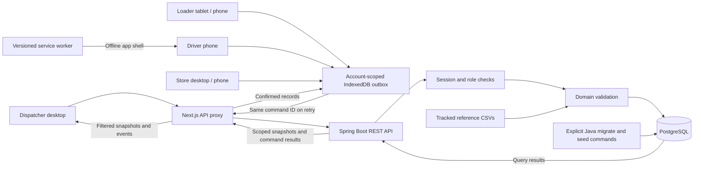

# Architecture

Waypoint connects four working environments through one authoritative order record. Next.js serves the responsive UI and proxies `/api/*` through its catch-all route to Spring Boot at `BACKEND_URL`. Spring owns authentication, planning, commands and PostgreSQL access. Vercel can host the frontend, but Spring requires a separate host; Neon is a supported managed PostgreSQL option. Local Compose includes PostgreSQL on a persistent volume. These are deployment configurations, not evidence of a running public deployment.

## State and recovery

Every order mutation uses an expected order version. The API applies role, assignment, lifecycle and payload checks. A serializable transaction writes the new order, proof bytes, audit event and command result together. Serialization failures and deadlocks receive bounded retries that rerun version and planning checks. Repeating an accepted command ID with the same normalized payload returns the original result. A changed payload under the same ID is rejected.

The browser writes field actions to IndexedDB before showing a saved acknowledgment. The account-scoped queue survives reload. Optimistic state overlays only pending actions; the server remains authoritative. A conflict remains in Needs review, and the user reviews the latest record before explicitly discarding an action. Authentication expiry does not clear the queue. Sign-out is blocked while local commands remain.

Work becomes durable on the device when the saved acknowledgment appears. Clearing browser data, losing the device, or closing the page before the local transaction completes can lose unconfirmed work. Offline first-time login and undownloaded routes are not supported.

## Planning

The deterministic allocator prioritizes prior skips, Fresh, chilled demand and closing windows. Each route uses one depot, brand and district. Weight, volume, temperature, van-only access, receiving windows, service, return distance, turnaround, two daily trips, vehicle availability and weekly fuel reservations are validated.

Assignment review tries each insertion point on existing trips and an additional trip on eligible vehicles. It revalidates the complete draft, including subsequent trips. It reports feasibility, arrival, fuel/distance changes and remaining capacity. This is a local decision aid, not a proof of global optimality. Preview is read-only; applying and publishing validate again. Draft revisions reject stale edits.

A published plan retains a demand snapshot. Deferred orders retain their identity, original requested date and audit history while moving to the next operating run that has not been published. Skip count increments once per publication. A later draft must be regenerated if carried orders changed its coverage.

## Deployment boundary

Multiple Spring instances share PostgreSQL sessions, command receipts and login throttling. Staff administration uses trusted-host CLI commands; account changes revoke sessions and record an account audit event. The legacy Node service under `frontend/lib/` supports scripts and regression tests and does not serve browser API requests. Schema migrations and seeding run explicitly before deployment, never during requests or builds. See [deployment.md](deployment.md) for Vercel + Neon setup. HTTPS is required outside localhost for service workers; set COOKIE_SECURE=1. The seeded password is set at initial database creation, not on every restart. Rotating the environment variable does not rotate existing accounts. This build is a competition demonstrator, not a multi-tenant logistics deployment.

No external maps API, SMS, live GPS, demand prediction service or background messaging integration is required. Dispatchers see the last synchronized server record, not an invented location or offline-device heartbeat.

Proof bytes live in a separate PostgreSQL table for the testing release and are fetched through an authenticated, order-scoped endpoint. State and historical plan responses carry references, not embedded images. Downloaded proof is cached in account-scoped IndexedDB; uncached proof is explicitly unavailable offline. The shared service worker never caches authenticated API responses. Hidden tabs pause periodic polling and resume synchronization when visible. Visible clients synchronize every ten seconds. State requests currently read all plans and events, then filter for account access; history is not paginated. Bound history retrieval and measure representative fleet workloads before sustained production use.
