# Data model

Generated from the live migrations by `scripts/data-model.py`: 95 tables in 13 schemas. Regenerate after any migration; do not edit by hand. The design reasoning, findings and target model are in [DATA-MODEL-REVIEW.md](architecture/DATA-MODEL-REVIEW.md); the components that own each schema are in [architecture.md](architecture.md).

## How the schemas connect

Each module owns one schema and is the only writer to it. Foreign keys point only into `ref` and `iam`; every other reference between modules is by id with no foreign key, so one module's migration never waits on another's (AGENTS.md, Data and Migration Rules). Lines below are real foreign keys between schemas.

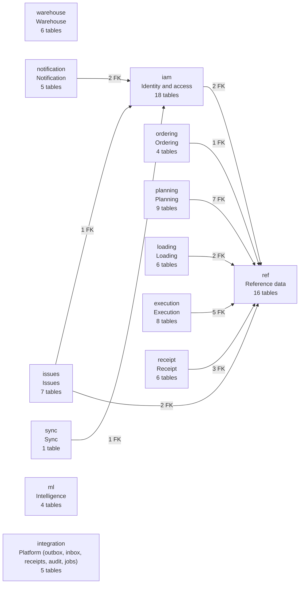

Conventions: UUIDv7 surrogate keys with dataset identifiers kept as unique natural keys, `timestamptz` everywhere, `numeric` with explicit precision for weight, volume and fuel, and `row_version` checked on every update. Operational tables have forced row-level security by depot, outlet or actor, and module roles hold no `DELETE`: operational rows reach terminal states instead. Diagrams show the columns that connect rows (keys, references, status, versions); the table under each lists every table's purpose from its `COMMENT ON TABLE`.

## `ref`: Reference data

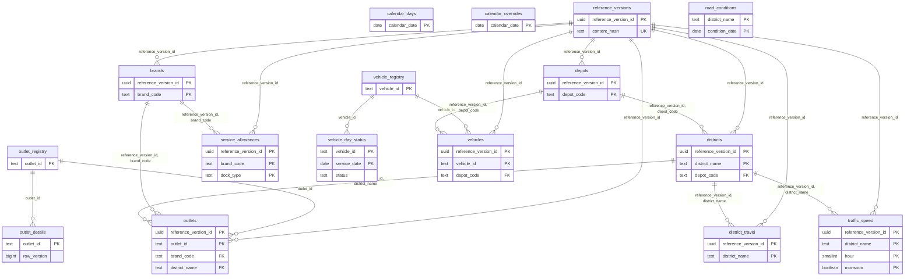

| Table | Purpose | Columns |
| --- | --- | --- |
| `brands` |  | 3 |
| `calendar_days` |  | 13 |
| `calendar_overrides` | A person overruling the calendar for one day. Read on top of ref.calendar_days when a snapshot is loaded, so it survives a reference import. | 5 |
| `depots` |  | 4 |
| `district_travel` |  | 8 |
| `districts` |  | 3 |
| `outlet_details` | A store's own delivery window, dock type and contacts, set by its manager. Read on top of the current reference version when a snapshot is loaded, so it survives an import (R-REF-01). | 10 |
| `outlet_registry` |  | 1 |
| `outlets` |  | 12 |
| `reference_versions` |  | 6 |
| `road_conditions` |  | 3 |
| `service_allowances` |  | 4 |
| `traffic_speed` |  | 5 |
| `vehicle_day_status` |  | 6 |
| `vehicle_registry` |  | 1 |
| `vehicles` |  | 10 |

## `iam`: Identity and access

```mermaid
erDiagram
  action_catalogue {
    text action PK
  }
  devices {
    uuid device_id PK
    text depot_code
    bigint row_version
    uuid registered_by FK
  }
  login_attempts {
  }
  oauth_authorization_codes {
    text code_hash PK
    uuid client_id FK
    uuid user_id FK
  }
  oauth_clients {
    uuid client_id PK
  }
  pin_attempts {
    uuid user_id FK
    bigint attempt_id PK
  }
  policies {
    uuid policy_id PK
    text name UK
    uuid created_by FK
    bigint row_version
  }
  policy_attachments {
    uuid attachment_id PK
    uuid policy_id FK
    text principal_type UK
    text principal_id UK
    uuid attached_by FK
  }
  policy_generation {
    boolean singleton PK
  }
  policy_versions {
    uuid policy_version_id PK
    uuid policy_id FK
    integer version_number UK
    uuid created_by FK
  }
  roles {
    text role_code PK
  }
  session_operators {
    bigint interval_id PK
    uuid user_id FK
  }
  sessions {
    text token_hash PK
    uuid user_id FK
    uuid device_id FK
    uuid operator_user_id FK
    uuid oauth_client_id FK
  }
  user_depot_access {
    uuid user_id PK
    text depot_code PK
  }
  user_outlet_access {
    uuid user_id PK
    text outlet_id PK
  }
  user_roles {
    uuid user_id PK
    text role_code PK
  }
  users {
    uuid user_id PK
    text email UK
    bigint row_version
    text employee_code UK
  }
  vehicle_driver_assignments {
    uuid assignment_id PK
    text vehicle_id FK
    uuid driver_user_id FK
    uuid assigned_by FK
    bigint row_version
  }
  users ||--o{ user_roles : "user_id"
  roles ||--o{ user_roles : "role_code"
  users ||--o{ user_depot_access : "user_id"
  users ||--o{ user_outlet_access : "user_id"
  ref_outlet_registry ||--o{ user_outlet_access : "outlet_id"
  ref_vehicle_registry ||--o{ vehicle_driver_assignments : "vehicle_id"
  users ||--o{ vehicle_driver_assignments : "driver_user_id"
  users ||--o{ vehicle_driver_assignments : "assigned_by"
  users ||--o{ sessions : "user_id"
  devices ||--o{ sessions : "device_id"
  users ||--o{ policies : "created_by"
  policies ||--o{ policy_versions : "policy_id"
  users ||--o{ policy_versions : "created_by"
  policies ||--o{ policy_attachments : "policy_id"
  users ||--o{ policy_attachments : "attached_by"
  users ||--o{ sessions : "operator_user_id"
  users ||--o{ session_operators : "user_id"
  users ||--o{ pin_attempts : "user_id"
  users ||--o{ devices : "registered_by"
  oauth_clients ||--o{ oauth_authorization_codes : "client_id"
  users ||--o{ oauth_authorization_codes : "user_id"
  oauth_clients ||--o{ sessions : "oauth_client_id"
```

| Table | Purpose | Columns |
| --- | --- | --- |
| `action_catalogue` |  | 4 |
| `devices` |  | 10 |
| `login_attempts` |  | 5 |
| `oauth_authorization_codes` | One-time codes between sign-in and token exchange. Only the hash is stored; consumed_at makes a code single use. | 10 |
| `oauth_clients` | Public OAuth clients that registered themselves for the remote MCP endpoint. No secret is ever issued. | 6 |
| `pin_attempts` | Shared across replicas, or a second replica is a bypass. Five failures pause PIN entry for that person. | 5 |
| `policies` |  | 7 |
| `policy_attachments` |  | 6 |
| `policy_generation` |  | 3 |
| `policy_versions` |  | 7 |
| `roles` |  | 2 |
| `session_operators` | Who operated a shared device and when. A queued write is accepted for the operator whose interval covers its recorded time. | 7 |
| `sessions` |  | 12 |
| `user_depot_access` |  | 2 |
| `user_outlet_access` |  | 2 |
| `user_roles` |  | 2 |
| `users` |  | 12 |
| `vehicle_driver_assignments` |  | 7 |

## `ordering`: Ordering

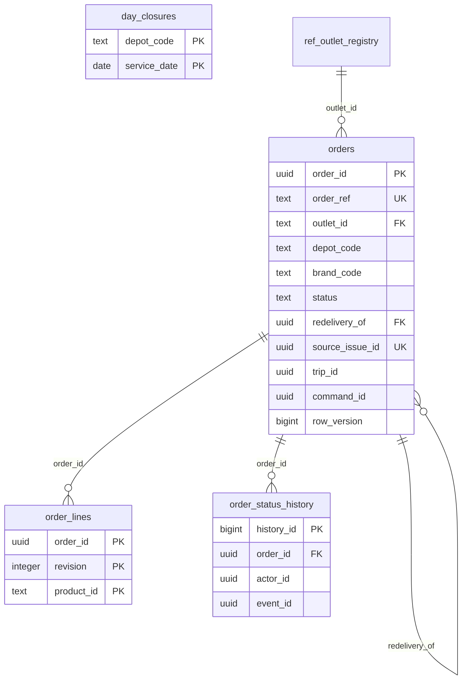

| Table | Purpose | Columns |
| --- | --- | --- |
| `day_closures` | orders.closed happened for this depot and day. Amendments stop, new orders roll forward. | 5 |
| `order_lines` | Descriptive only. The current lines are those at orders.line_revision. | 4 |
| `order_status_history` | Every status change with its actor, reason and time (architecture rule 8). Null actor is the system. | 8 |
| `orders` | One outlet's demand for one delivery date. Status moves only along OrderStateMachine. | 26 |

## `warehouse`: Warehouse

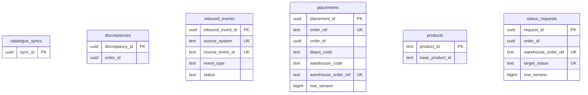

| Table | Purpose | Columns |
| --- | --- | --- |
| `catalogue_syncs` |  | 7 |
| `discrepancies` |  | 9 |
| `inbound_events` |  | 15 |
| `placements` | What Waypoint asked the warehouse and what it answered. The memory that makes a retry a lookup, not a second order (R-STK-11). | 23 |
| `products` | Cached projection of the warehouse catalogue (CAT-01). Reconstructed, accurate to ~1%; display only, never capacity. | 10 |
| `status_requests` |  | 12 |

## `planning`: Planning

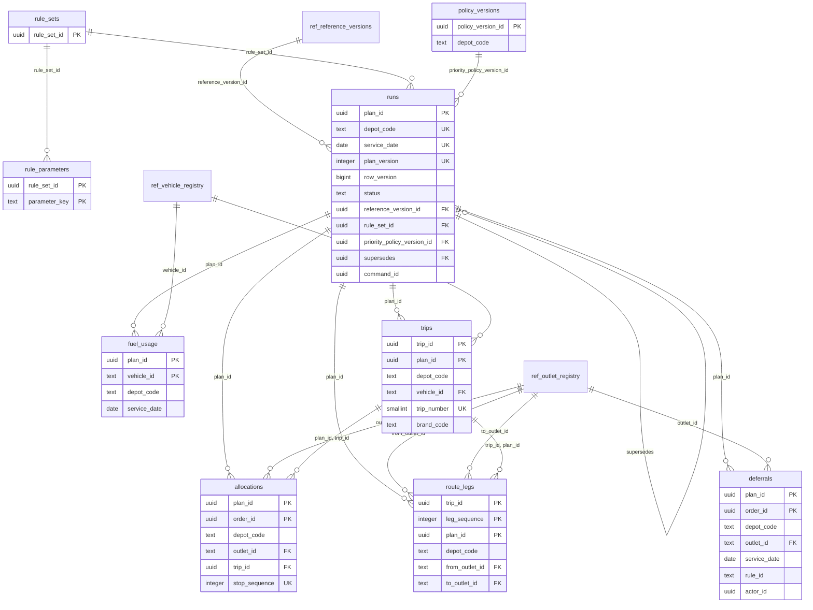

| Table | Purpose | Columns |
| --- | --- | --- |
| `allocations` |  | 14 |
| `deferrals` | Who deferred which order, why, and how often it has now been skipped (rule 8, R-PLN-20). The engine is the system actor. | 10 |
| `fuel_usage` | Litres per vehicle per run. Weekly usage counts published runs only; a draft never consumes quota (D-K, B15). | 6 |
| `policy_versions` | Effective-dated decision tables. keys is the ordered PriorityPolicy.Key list, highest priority first (R-PLN-21). | 9 |
| `route_legs` | Planned times only. Actual times belong to Execution. | 9 |
| `rule_parameters` |  | 4 |
| `rule_sets` | Effective-dated rule parameters. Immutable except closing effective_to when a successor starts. | 6 |
| `runs` | One planning run for a depot and day. plan_version is the business revision, row_version the concurrency revision. | 23 |
| `trips` |  | 13 |

## `loading`: Loading

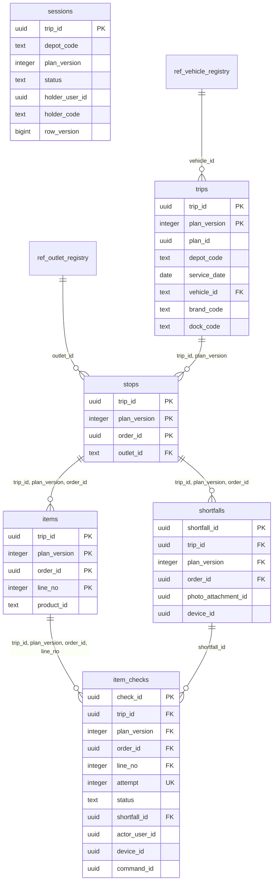

| Table | Purpose | Columns |
| --- | --- | --- |
| `item_checks` | Append only. The latest attempt per item line is its state; earlier attempts are the custody record. | 15 |
| `items` | The item lines of an order: one product and its unit count. Descriptive; the product id is inferred, never a verified SKU. | 6 |
| `sessions` | The dock work on one trip. row_version moves on by one per accepted command and per plan revision. | 16 |
| `shortfalls` | An item flagged before departure. Not loaded; the dispatcher and store are told (loading.shortfall). Never deleted. | 14 |
| `stops` | One order on one trip version, in delivery order. Measures copied from Ordering; authoritative for capacity. | 11 |
| `trips` | A published trip as Loading received it, one row per plan version. The current row has superseded_at null. | 17 |

## `execution`: Execution

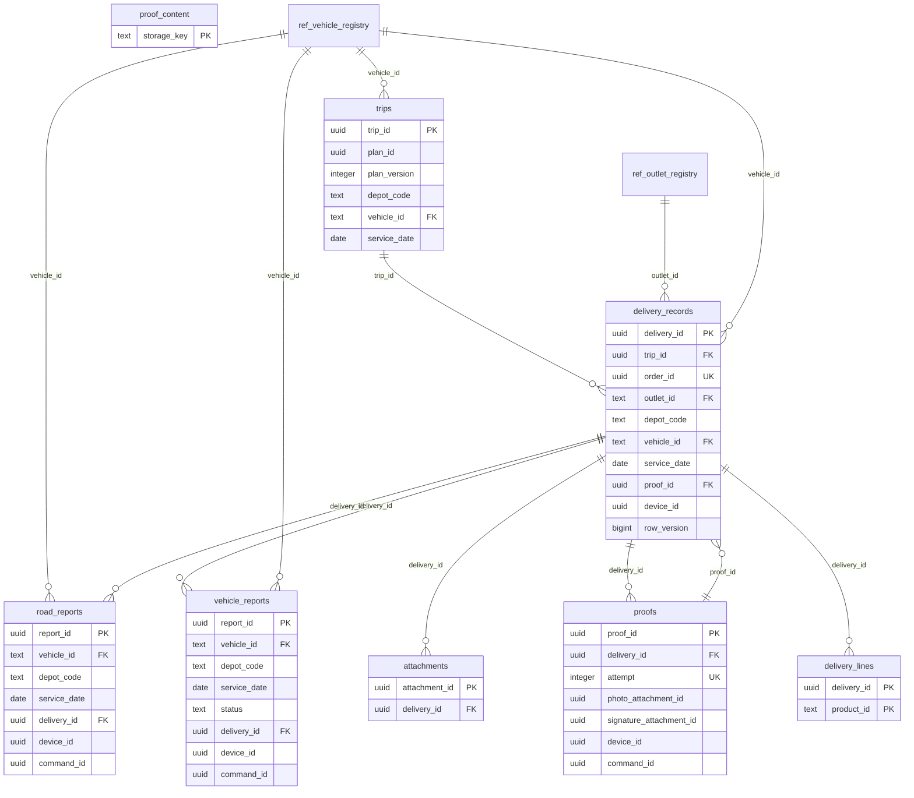

| Table | Purpose | Columns |
| --- | --- | --- |
| `attachments` | A proof artifact held in the proof store. The id is minted on the device, so a repeated upload is a no-op. | 12 |
| `delivery_lines` | The order's products at release, and what arrived of each. The product id is the warehouse's inferred candidate, never a verified SKU. | 4 |
| `delivery_records` | One order at one stop of a released trip, and what happened there. row_version moves on by one per accepted command. | 36 |
| `proof_content` | The bytes of a proof photo or signature, keyed as execution.attachments.storage_key. Cleared, never deleted, past retention. | 6 |
| `proofs` | Append only. The latest attempt is the delivery's proof; earlier ones stay as evidence. recipient_name is personal data. | 13 |
| `road_reports` | A road fault or delay a driver reported (R-EXE-07). | 12 |
| `trips` | A trip as it left the dock (trip.released). announced_delay_minutes is the delay last told to the stops ahead. | 8 |
| `vehicle_reports` | What a driver reported about the vehicle (R-EXE-06). A report changes nothing in reference data; the dispatcher applies vehicle:SetDayStatus. | 13 |

## `receipt`: Receipt

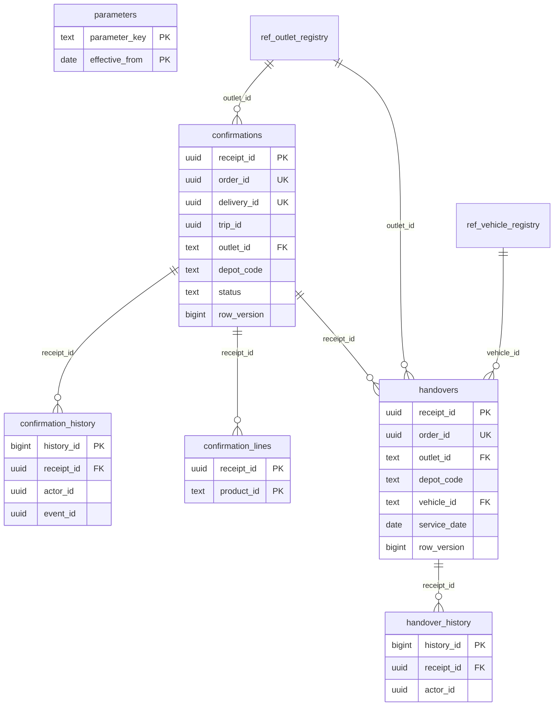

| Table | Purpose | Columns |
| --- | --- | --- |
| `confirmation_history` | Every status change with its actor, reason and time (rule 8). The system actor closes; a person answers. | 8 |
| `confirmation_lines` | Per product: what the order said would arrive and what the store says did (D-E). | 4 |
| `confirmations` | The store's acceptance of one delivered order, separate from the driver's proof (R-RCP-04). | 18 |
| `handover_history` |  | 5 |
| `handovers` | The one-time PIN the store shows and the driver enters. Evidence of presence, never a gate (R-RCP-09). | 17 |
| `parameters` |  | 6 |

## `issues`: Issues

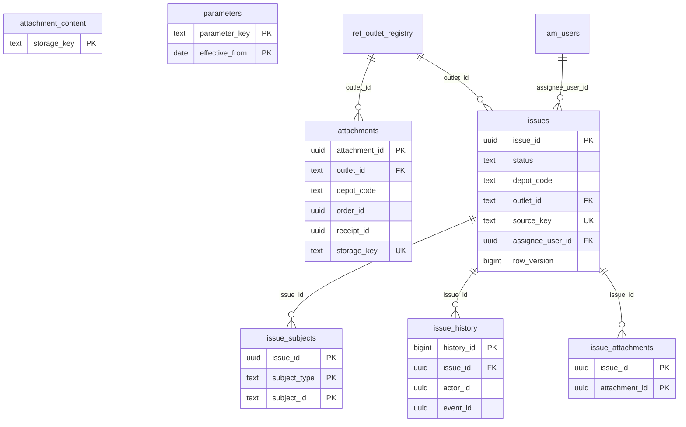

| Table | Purpose | Columns |
| --- | --- | --- |
| `attachment_content` | The bytes of an issue photo, keyed as issues.attachments.storage_key. Cleared, never deleted, past retention. | 6 |
| `attachments` | A photo of a delivery problem, uploaded by the store for an order. Linked to issues through issues.issue_attachments. | 13 |
| `issue_attachments` |  | 3 |
| `issue_history` | Every change with its actor, reason and time (rule 8), escalations included. | 9 |
| `issue_subjects` |  | 3 |
| `issues` | One operational problem: owner, lifecycle, recorded resolution. Never deleted. | 21 |
| `parameters` |  | 5 |

## `notification`: Notification

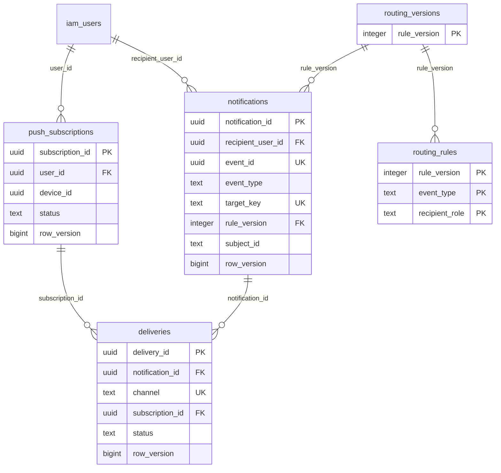

| Table | Purpose | Columns |
| --- | --- | --- |
| `deliveries` | Each channel a notification went out on, with every attempt counted. A push that keeps failing reaches dead and stays. | 11 |
| `notifications` | One message to one person about one event. Kept forever; read state only ever moves from unread to read. | 13 |
| `push_subscriptions` | A browser push endpoint per person and device. One browser has one endpoint, so it is active for one person at a time. | 10 |
| `routing_rules` | Event type to recipient role and scope, with the message template. {name} is filled from the event. | 10 |
| `routing_versions` | One version of the routing matrix is current. A change is a new version, never an edit. | 4 |

## `sync`: Sync

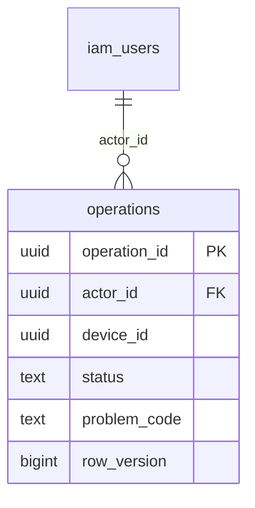

| Table | Purpose | Columns |
| --- | --- | --- |
| `operations` |  | 18 |

## `ml`: Intelligence

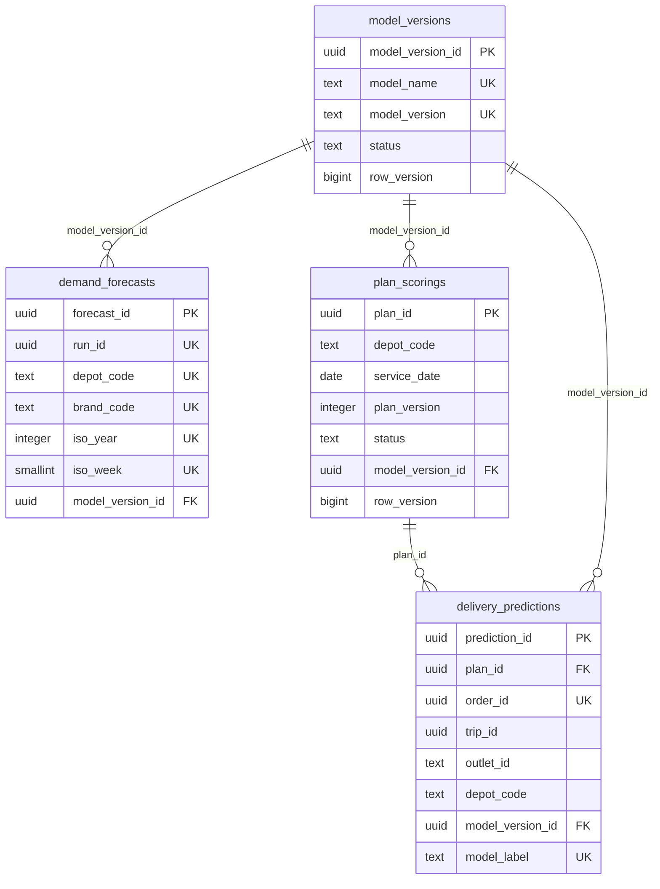

| Table | Purpose | Columns |
| --- | --- | --- |
| `delivery_predictions` |  | 13 |
| `demand_forecasts` | Weekly depot x brand forecasts. Every run is kept; a read takes the newest per week. | 12 |
| `model_versions` | Model registry. A model is used only while active and only when the serving process reports the same name and version. | 17 |
| `plan_scorings` | One per published plan: whether its stops were scored by a model or by the deterministic estimator, and why. | 14 |

## `integration`: Platform (outbox, inbox, receipts, audit, jobs)

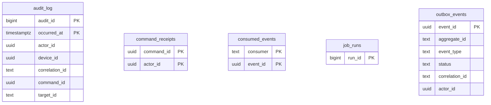

| Table | Purpose | Columns |
| --- | --- | --- |
| `audit_log` |  | 15 |
| `command_receipts` |  | 7 |
| `consumed_events` | One row per event a consumer has applied. Makes at-least-once delivery idempotent. | 3 |
| `job_runs` | One row per run of a scheduled job. error holds an exception class, never data. | 6 |
| `outbox_events` |  | 16 |
