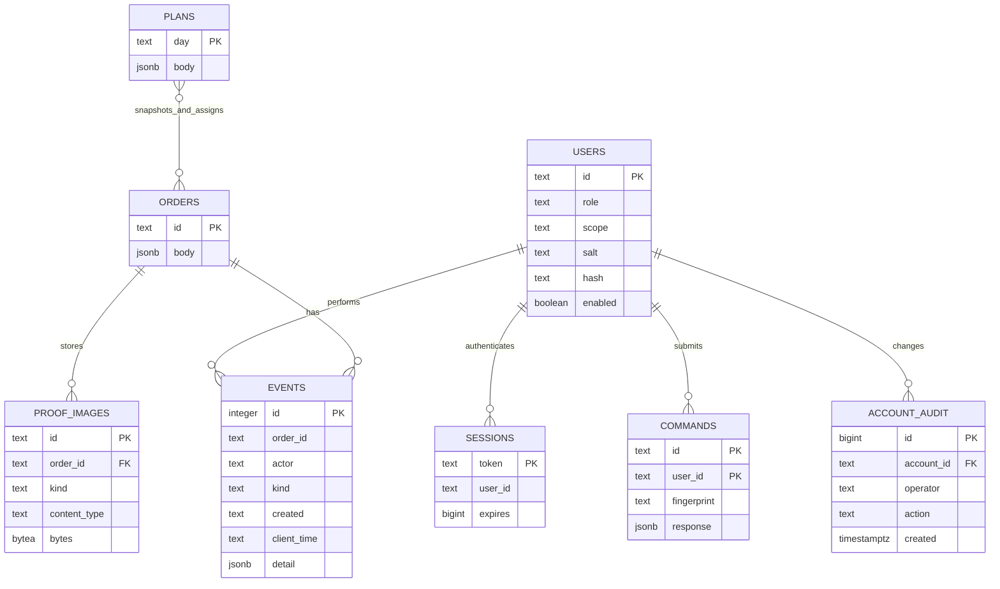

# Data model

The diagram shows logical order/event and plan/order relationships; plan membership is stored in JSONB rather than a join table. `users.enabled` controls sign-in and session validity. `account_audit` records trusted-host account changes separately from delivery events. Password resets, scope changes and enable/disable operations revoke existing sessions.

`settings(key, value)` records versioned seed initialization. Reference outlets, vehicles, operating days, travel and service allowances are loaded from tracked CSVs. PostgreSQL foreign keys connect sessions and command receipts to users, events to their actors, and proof images to orders. Event order IDs also support the global `*` marker; order/event and plan/order membership is validated by the service.

Indexed generated columns expose day, outlet, depot, vehicle, status and version from the JSONB order body without maintaining duplicate values in application code. An order body contains outlet/depot/access requirements, current run day, original requested day when carried over, quantities, status, monotonically increasing version, skips, route assignment, deferral, loading issue/resolution, proof and store dispute. Driver proof and store receipt are separate actions. Exception resolutions preserve the original evidence and add the decision, actor and note; redelivery records link the original and replacement order IDs. Event times preserve both the server timestamp and the submitted device timestamp; device clocks are not treated as authoritative.

A plan body contains day, revision, published flag, demand snapshot, ordered trips and deferred decisions. Each trip stores order IDs, arrival and service times, start, return/turnaround completion, distance and fuel. Snapshots retain the original decision even after outstanding orders move forward. Non-dispatcher responses are filtered to account assignments.

The outbox is stored locally under `queue:<account-id>`; snapshots use `state:<account-id>`. Photo and signature data live in the queued command until accepted, then as bytes in `proof_images(id, order_id, kind, content_type, bytes)`. Order proof metadata contains `photo_id` and `signature_id`. The authenticated `/api/proof?order_id=...&image_id=...` endpoint returns one image as a data URL; downloaded images use `proof:<account-id>:<image-id>` in IndexedDB. Audit event details omit image payloads. JSONB plan snapshots preserve historical decisions; larger deployments should normalize searchable operational fields and put images in private object storage with retention controls.

Unsubmitted delivery forms are saved separately in IndexedDB under `delivery-draft:<account-id>:<order-id>:<order-version>`. A draft contains outcome, receiver, count, note, photo and signature. Reopening the same account/order/version restores it for review; successful enqueueing of the delivery action triggers draft removal. Drafts are local form state, not server-confirmed proof or queued commands. The driver appearance preference is stored separately in localStorage under `waypoint-driver-appearance`.

`schema_migrations(name, checksum)` tracks immutable applied migrations. `login_attempts(email, attempted_at)` shares the 15-attempts-per-minute account limit across API instances. Sessions use hashed tokens and expiry timestamps. Seed commands are explicit, versioned and serialized to avoid duplicate initialization.
