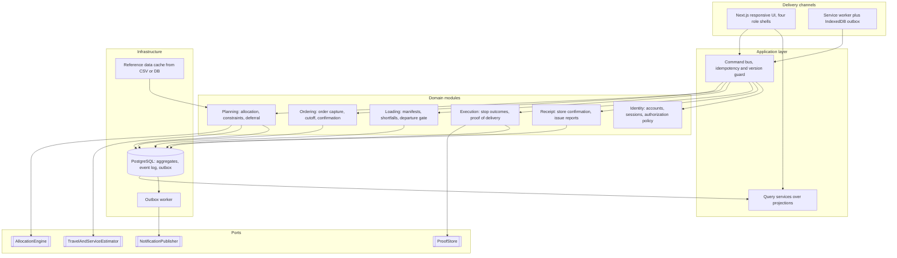
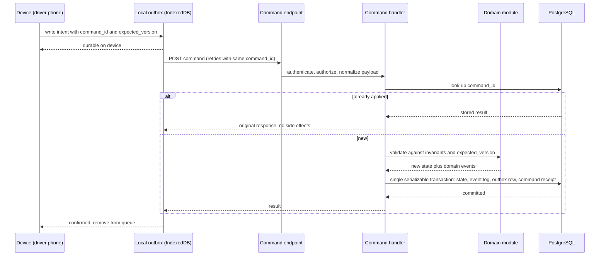

# Enterprise architecture plan

Audience: the Xception build team. This document explains how a delivery planning platform of this shape is built at enterprise level, what that means for Waypoint Dispatch specifically, where this repository already matches that target, where it does not, and the order in which to close the gap against the three competition deadlines.

It is a plan, not a record of completed work. Nothing here is claimed as implemented unless the gap table says so. The concrete folder layout, its rules and the migration stages live in [code-structure.md](code-structure.md).

## 1. What the problem actually is

The booklet reads as one product, but it is three systems with different quality attributes. Designing them as one thing is the most common way teams lose the engineering marks.

| Subsystem | Core problem type | Dominant quality attribute | Correctness test |
| --- | --- | --- | --- |
| Order capture and receipt | Transactional workflow across roles | Consistency and auditability | No order is lost, duplicated or silently reduced |
| Planning and allocation | Constrained resource allocation (capacitated VRP with time windows, heterogeneous fleet, weekly fuel budget) | Explainability, then throughput | Every published plan satisfies every stated constraint, and every deferral has a recorded reason |
| Field execution | Occasionally connected distributed writes | Availability under partition | Work done offline is never lost and never applied twice |
| Forecasting (Datathon) | Supervised learning on operational history | Reproducibility | Labels are constructed from documented reasoning, inference runs from saved artifacts |

Three consequences follow immediately:

1. The write path must be transactional and idempotent. The read path does not need the same guarantees, so it should not pay their cost.
2. Allocation is a decision that must be defended, not just produced. A plan a dispatcher cannot explain to a store manager is worthless to Waypoint, and the booklet weights the allocation engine at 20 percent while judging "feasibility and the reasoning behind your decisions".
3. Offline is a first class requirement, not a progressive enhancement. It changes the data model (client generated identifiers, versions, idempotency keys), not just the UI.

### The constraint set is the specification

These are the hard rules the system must never violate. They belong in one place in the code, expressed once, reused by the allocator, the manual override path and the publication gate.

- Weight limit and volume limit, both per trip.
- Chilled or frozen goods require `temp = reefer`. Reefers may carry ambient.
- `parking_constraint = van_only` requires `type = van`.
- A vehicle serves only its home depot's outlets.
- A trip serves one brand and one district.
- Whole orders only. No splitting across vehicles or trips.
- Maximum two trips per vehicle per day.
- Time budgets: 270 minutes for Fresh trips (03:30-08:00), 480 minutes combined for Style and Tech, checked separately, still two trips total.
- Weekly fuel quota per vehicle, consumed by route distance, reset Monday to Sunday.
- Outlet delivery windows, with mall outlets restricted to the mall access window. Early arrival waits, late arrival is a service failure.
- Operating days come from `calendar.csv`, Monday to Saturday.

The trip time formula from the booklet is the planning cost model and should be implemented exactly as stated: `trip_minutes = depot_to_district_freeflow_min + inter_stop_freeflow_min * (stops - 1) + sum(service_allowance_min per stop)`.

## 2. How this class of system is built at enterprise level

Commercial transportation management platforms (Oracle OTM, Descartes, Blue Yonder, and the newer last mile products) converge on the same four stage pipeline: **capture, plan, execute, settle**. Around that pipeline the recurring architectural decisions are remarkably consistent, and they are the ones worth copying.

### 2.1 Modular monolith with domain modules, not microservices

The industry has moved back toward the modular monolith for systems at this scale: one deployable, but organized into loosely coupled modules with explicit boundaries and interfaces, each owning its data, communicating by in-process events or explicit command and query interfaces rather than by reaching into each other's tables. Modules are organized around business capability, not technical layer. This keeps the deployment and transactional story simple while preserving the option to extract a module later, which is exactly the trade a small team building in eight days should want.

For a 120 outlet, 60 vehicle network, microservices would add network partitions, distributed transactions and operational surface for zero benefit. The architecture marks are awarded for clear boundaries and correct transactions, not for service count.

### 2.2 The write path: command bus, idempotency keys, optimistic concurrency

Every business mutation carries a client generated idempotency key. The server authenticates, looks the key up in scope, returns the stored response if it exists, and otherwise executes the mutation and stores key plus response atomically in the same transaction. Every mutation also carries the expected aggregate version, so a stale device is rejected rather than allowed to overwrite.

This is the standard enterprise pattern for field operations and it is the correct answer to "the driver's phone retried while offline". Waypoint Dispatch already implements it.

### 2.3 Offline: local store as buffer, server authoritative

The pattern for business field apps is not CRDTs. It is: the device holds a working copy plus an outbox of intent, writes land in the local store inside a local transaction before the UI acknowledges, a background worker drains the outbox with exponential backoff when connectivity returns, and conflicts resolve in the server's favour or by an explicit human review step. CRDTs and operational transformation are for collaborative editing, not for proof of delivery, and choosing them here would be over-engineering.

The important enterprise detail is that the acknowledgment shown to the driver must mean "durable on this device", not "sent".

### 2.4 The read path: CQRS separation and projections

Read and write models diverge. Writes go through the aggregate with full validation. Reads are served from projections shaped for a specific screen, rebuilt from the event log. Logistics providers use this to keep operational views fast while writes continue against the authoritative log, and use the append only event log itself for parcel handoff traceability and incident investigation.

Waypoint needs exactly this: the dispatcher's progress board, the store manager's order timeline and the driver's run sheet are three different shapes over the same events.

### 2.5 Outbound integration: transactional outbox

Notifications to store managers ("your order is deferred", "expected arrival 06:40") must not be sent inside the request transaction, and must not be lost if the process dies after commit. The transactional outbox writes the intent to send into the same database transaction as the state change, and a separate worker delivers it. This is the same mechanism as the client outbox, applied server side.

### 2.6 The solver sits behind a port

Production routing systems do not embed the optimizer in the domain. They define a port: problem in, solution plus explanation out, with a time budget. Behind it sits a greedy or insertion heuristic for fast interactive replanning, and optionally a metaheuristic engine (Timefold Solver, the OptaPlanner successor, or Google OR-Tools) for the overnight batch. Both open source solvers are engineering toolkits rather than finished platforms, and production deployment on them carries real integration cost, which is the reason to keep them behind an interface rather than to depend on one.

For this competition the deterministic heuristic is the right primary engine, because it is explainable, fast, testable and reviewable in a demo video. The port is what demonstrates architectural thinking.

### 2.7 Predictions are a port too

Enterprise TMS treats ETA and service time estimation as a separate model serving concern consumed through an interface, with a deterministic fallback when the model is unavailable. The booklet explicitly does not require Datathon integration into the Hackathon build. The architecturally correct move is therefore to define the port, ship the deterministic implementation, and show where the model plugs in.

## 3. Target architecture for Waypoint Dispatch

### 3.1 Bounded contexts and module map



Module rules, enforced rather than documented:

- A module exposes commands, queries and events. Nothing else is public.
- No module reads another module's tables. Cross module reads go through a query interface, cross module reactions go through domain events.
- `Planning` depends on no framework. It is pure functions over value objects, which is what makes the constraint set testable.
- Only the application layer opens transactions. Domain modules never touch a connection.

### 3.2 Write path



Rules: one transaction per command. Bounded retries on serialization failure that re-run validation rather than blindly replaying. A repeated command id with a changed payload is rejected, not merged.

### 3.3 Read path and sync contract

Replace "fetch everything and filter in the application" with a cursor based delta protocol:

- `GET /sync?since=<cursor>&scope=<role scope>` returns only events after the cursor that the caller is entitled to see, plus the new cursor.
- Scope filtering happens in SQL, driven by the authorization policy, not in Java after loading rows.
- History endpoints are paginated with keyset pagination on `(order_id, id)`.
- Server sent events push the cursor forward when something changes, with the existing poll retained as the fallback for hostile networks. Hidden tabs stay paused.

This single change is the difference between a system that works for 4 judges and a system that works for 1500 drivers.

### 3.4 Planning engine design

```
AllocationRequest  = day, depot scope, orders, fleet snapshot, reference data, fuel reservations, time budget
AllocationResult   = trips, deferrals with reasons, per constraint slack, evaluation trace
AllocationEngine   = interface { AllocationResult allocate(AllocationRequest) }
```

Implementations: `PriorityInsertionEngine` (the current deterministic heuristic, primary), later `MetaheuristicEngine` (time boxed, optional, same interface). A `ValidatingEngine` decorator re-checks any result against the constraint registry before it is allowed to leave the module, so a future optimizer cannot introduce an infeasible plan.

The constraint registry is the key design object. Each constraint is a named unit that reports pass, fail with a human readable reason, and remaining slack. The allocator consumes it, the manual override path consumes it, the publication gate consumes it, and the UI renders its reasons directly. One definition, four consumers, and explainability becomes a property of the architecture rather than a feature someone has to remember to write.

Priority policy, which must be stated in the UI and in the README because the booklet asks for the reasoning: previously skipped outlets first, then Fresh, then chilled, then earliest closing window, with ties broken deterministically. Deferral records the binding constraint, not a generic message.

### 3.5 Why allocation shards perfectly

The booklet's own feasibility rules state that all orders sharing a vehicle and trip belong to the same brand and district, and a vehicle serves only its home depot. Therefore the day's problem decomposes into independent subproblems keyed by `(depot, brand, district)`, coupled only through the shared vehicle pool and the weekly fuel budget. That gives a scale story that does not require new technology: solve subproblems in parallel, reconcile the two shared resources in a final pass. Say this out loud in the demo video. It is the kind of observation that distinguishes an architect from an implementer.

## 4. Where this repository stands against the target

Verified by reading the code, not assumed.

| Area | Current state | Enterprise target | Gap |
| --- | --- | --- | --- |
| Write path | Single `POST /api/command`, command receipts, expected version, serializable transaction with bounded retries | Same | None. This is already correct and should be showcased. |
| Idempotency | `commands` table, same id plus same normalized payload returns original result, changed payload rejected | Same | None. |
| Constraint expression | `planning/domain/Planning.java`, 403 lines, pure static functions, `REASONS` map, `validateRoute` returns structured reasons | Constraint registry as first class named units with slack | Small refactor, high value. |
| Service layer | `service/DispatchService.java`, now 1742 lines, still mixing sessions and login throttling, seeding and scenarios, state assembly, planning orchestration, command dispatch, events and proof images. The SQL seam is out, in `platform/db/Database` | Six modules with explicit interfaces | Still the largest single gap. This is what "engineering quality and architecture" at 25 percent is looking at. Module folders and boundary tests are in place, so the remaining work is extraction, not layout. |
| Read path | `GET /api/state` loads all plans and events then filters in application code, history unpaginated, all clients poll every 10 seconds | Cursor delta sync, SQL scoped, keyset paginated, SSE with poll fallback | Second largest gap, and the only one that is a genuine scalability defect. |
| Offline | IndexedDB account scoped outbox, durable acknowledgment before UI confirms, conflicts held in "Needs review", sign out blocked with pending work | Same | None. Already the recommended pattern. |
| Outbound notification | None. Store manager polls | Transactional outbox plus worker | Medium. Also unlocks deferral notice and ETA notice, both named in the booklet. |
| Proof of delivery bytes | PostgreSQL table, authenticated order scoped endpoint | Object storage behind a `ProofStore` port with presigned URLs | Port now, object storage later. Database BYTEA is acceptable at competition scale and should be labelled as a deliberate trade. |
| Prediction | Explicitly absent, and the README says so | `TravelAndServiceEstimator` port with deterministic implementation | Small. Define the port, wire the deterministic buffer through it. |
| Module enforcement | Single Maven module, packages by business module, boundaries asserted by `ModuleBoundaryTest` (7 ArchUnit rules) and `frontend/tests/boundaries.test.ts` (5 rules) | Same | Closed. Both guards were verified to fail on a planted violation. |
| Observability | `/api/health` only | Structured logs with correlation id, Micrometer metrics, planning decision audit | Small, worth doing before the demo. |
| Frontend structure | Organized as `src/app-shell`, `src/roles/{dispatcher,loader,driver,store}` and `src/shared/{ui,domain,offline}` behind path aliases | Container and view split inside each role | Partly closed. Folders and aliases done; `Dispatcher.tsx` at 1271, `Workspace.tsx` at 902 and `Store.tsx` at 733 still need splitting. |
| Reference data | CSV loaded into memory at startup by `ReferenceLoader` | Database backed with a cache, CSV as seed only | Leave as is. Correct for 120 outlets, and the trade should be documented. |
| Duplicate implementation | Legacy Node service in `frontend/lib/service.ts` at 994 lines, parallel to the Spring service, used by regression tests | One authoritative implementation | Judges will notice two implementations of the same rules. Either delete it or document precisely why it exists. |

### Scale analysis, with numbers

Today: 120 outlets, roughly 200 orders per day, 60 vehicles. Every component is comfortable.

At 10x network size (1200 outlets, 600 vehicles, 2000 orders per day) the failure order is:

1. `GET /state` first. Each poll reads the entire event history and filters in memory. With 600 drivers plus dispatchers polling every 10 seconds, that is roughly 60 or more requests per second each doing a growing full scan. This breaks first and it breaks hard.
2. Unpaginated history next, as the event table grows without bound.
3. Proof images in PostgreSQL, as row size and backup time grow.
4. Allocation last, and only mildly, because of the sharding property in section 3.5.

Note the ordering: the read path fails long before the optimizer does. Teams usually plan to optimize the solver and get killed by their own polling loop.

## 5. What not to build

Stating this is part of the architecture, and the Designathon criteria explicitly reward "scope and prioritization" and "restraint".

- No microservices, no Kafka, no Kubernetes. One deployable, PostgreSQL, a worker.
- No full event sourcing with replay as the write model. The append only event log plus projections gives the audit and traceability benefit at a fraction of the cost.
- No CRDTs. The server is authoritative.
- No live GPS, no map routing API, no SMS gateway. The booklet does not ask for them and the README is currently honest about their absence. Keep it honest.
- No automatic order splitting. It is a dispatcher follow up, and that is already documented.
- No pre-trained models anywhere in the Datathon work. The rules prohibit them outside synthetic data generation and preprocessing, prohibit proprietary API based modelling, and prohibit low-code or automated end-to-end modelling tools.

## 6. Execution plan

Today is Day 2 of 15. The brief released Day 1, Friday September 25, 2026.

### Phase A: Designathon, due Day 5, Tuesday September 29, 23:59 Asia/Colombo

The nearest deadline is a design deliverable and the architecture work does not earn a single mark in it. The repository already holds the source material in `docs/design-rationale.md` and `docs/design-mapping.md`, and the working app is ahead of the design, which is an unusual and favourable position. The risk is that the deliverables are design artifacts the repository does not contain.

1. High fidelity prototype in a design tool. This is the critical path item and nothing in the repository substitutes for it. Screens are already implemented, so work from the running app.
2. One persona per role, grounded in the booklet's working conditions: dispatcher at a large screen with stable connectivity, loader on a shared dock tablet, driver on a personal phone while safely stopped, store manager at the outlet counter.
3. Screen flows for all four roles with a one paragraph rationale per screen, and the cross role handoffs made visible, because the booklet asks specifically that a dispatcher decision reaches the loader and a driver record reaches the store manager.
4. Degradation screen, fully designed, named, with a rationale paragraph. Weighted at 15 percent. The strongest candidate is the driver losing connectivity mid route: queued stop outcomes, durable local save, and the reconciliation review when coverage returns. The second candidate is demand exceeding capacity on a festival ramp day, showing which orders defer and why. Design one properly rather than three thinly.
5. Core trade off page, one page maximum: explainable deterministic allocation over opaque optimization.
6. AI tool disclosure. `docs/ai-disclosure.md` exists and needs to reflect actual usage.
7. Demo video, 3 to 5 minutes, unlisted on YouTube, walking the design and stating assumptions.
8. Export as `TeamName_Designathon`, zip, submit with prototype and video links. Preserve the Day 5 export, because Hackathon fidelity to it is worth 10 percent.

### Phase B: Hackathon, due Day 10, Sunday October 4, 23:59

Sequenced by marks per hour, not by interest.

Days 5 to 6, architecture work that is directly marked. Day 5 work starts only after the design file is submitted:

1. Split `DispatchService` into the six modules in section 3.1. Move SQL helpers to a repository per module, sessions and throttling to `identity`, seeding and scenarios to a separate seeder outside the request path, state assembly to query services. Do this as mechanical extraction with the test suite green after each step. No behaviour change.
2. Introduce `AllocationEngine`, `AllocationRequest` and `AllocationResult`, and move the current allocator behind it unchanged. Add the `ValidatingEngine` decorator.
3. Promote the constraint set to a named registry with slack reporting, and have the UI render its reasons.
4. Module boundary tests: done, keep them passing as the extraction proceeds.

Day 7, the read path:

5. Add `GET /sync?since=<cursor>`, push scope filtering into SQL, add keyset pagination to history, add SSE with the existing poll as fallback. Keep the old endpoint until the frontend has moved.

Day 8, integration and honesty:

6. Transactional outbox plus worker, driving the deferral notice and expected arrival notice to store managers.
7. `TravelAndServiceEstimator` port with the deterministic buffer behind it.
8. Correlation ids, metrics, planning decision audit.
9. Resolve the duplicate Node implementation question one way or the other.

Day 9, submission mechanics, which are worth more than they look:

10. Verify `docker compose up` from a clean clone and empty database brings up the full stack with seed data. The booklet requires this exact command.
11. Deploy behind HTTPS with `COOKIE_SECURE=1`, a private `SEED_PASSWORD`, and a separate database. Keep it live through judging and, if the team advances, through the semifinal and Grand Finale.
12. Refresh `docs/architecture.md` and `docs/data-model.md` to the delivered design. The booklet requires an architecture diagram and data model in a root `docs` folder.
13. Rename the repository to the `TeamName_SolutionName` convention. Currently `Xception-WaypointGo`, which does not match.
14. Re-run the numbered README walkthrough from a fresh install, then record the 5 to 8 minute video showing all four roles plus the architecture explanation.

Day 10, freeze. No pushes after the deadline count.

Hard rule for this phase: the Hackathon is judged on fidelity to the Day 5 design at 10 percent. Any refactor that changes a screen must be recorded in the README as a documented departure.

### Phase C: Datathon, due Day 15, Friday October 9, 23:59

Judged separately, and integration into the Hackathon build is explicitly not required. Treat it as its own repository area with its own reproducibility standard.

Blocking issue, resolve on Day 10 at the latest: the tracked `data/` directory is missing files the Datathon needs. Present are `outlets.csv`, `vehicles.csv`, `calendar.csv`, `district_travel.csv`, `service_allowance.csv`, a 560 row filtered `deliveries_train.csv`, and the two `task2b` files. Missing are `route_legs_train.csv`, `task1_test_inputs.csv`, `route_legs_test.csv`, `task2a_test_inputs.csv`, `traffic_speed.csv`, `road_conditions.csv`, the three submission templates and `check_allocation.py`. The full `deliveries_train.csv` is also needed, since the tracked copy was deliberately filtered to four February days for application seeding.

1. Task 1 labels, which carry the most weight in the wrangling criterion at 20 percent. Neither target is supplied, and correct construction is explicitly assessed. From the route legs: service time is `leave_outlet_time - arrival_time`, adjusted for the rule that a vehicle arriving before `window_open_time` waits, so handling starts at `max(arrival_time, window_open_time)`. Lateness is `arrival_time > window_close_time`, which is arrival after the window closes, not after planned arrival. Handle times crossing midnight, since Fresh runs from 03:30. Document the reasoning in the preprocessing write up, because the reasoning is what is marked.
2. Task 1 features from planned quantities only, since actual journey and handling times exist only in training records. Candidates: brand, dock type, order units, weight, volume, planned travel duration, distance, sequence position in route, district, hour of planned arrival, monsoon flag, day of week, `speed_index` from `traffic_speed.csv`, `disruption_index` from `road_conditions.csv`, and window slack as `window_close_time - planned_arrival_time`. Gradient boosted trees for the regression, a calibrated classifier for the probability, trained from scratch. Validate by time based split, never randomly, because the test period is later.
3. Task 2A, weekly volume per depot, brand and week. Count every order once including `deferred` and `not_run`, assign to the week the store requested using `iso_year` and `iso_week` from `calendar.csv`, and set chilled to zero for Style and Tech. Features from the calendar: payday, `festival_ramp`, holiday, monsoon, plus lags and rolling means per depot and brand series.
4. Task 2B, the peak day allocation. This is the same problem the Hackathon allocator already solves, so reuse the engine and export to `submission_task2b.csv` rather than writing a second allocator. Exclude `in_workshop` vehicles, implement the trip time formula exactly as the booklet specifies including the instruction not to add the return journey, and validate with the supplied `check_allocation.py` before submitting. The one page policy write up must show the calculations, identify the limiting resource, and separate unavoidable deferrals from chosen ones.
5. Final notebook retaining label construction, preprocessing, training and evaluation cells, plus a final cell that loads saved models and prints inputs and predictions for Task 1 and Task 2A. Save model files alongside it. Architecture diagram of models, preprocessing and proposed deployment. AI disclosure. Video, 3 to 5 minutes. Zip as `TeamName_Datathon`.

Submission identifiers must match exactly. Task 1 requires original row order preserved, Task 2A requires `row_id` preserved, and Task 2B requires every placeholder replaced with blanks for deferred rows. Mismatched identifiers cannot be scored, which converts a modelling effort into a zero.

## 7. Traceability to the judging criteria

| Criterion | Weight | Where this plan addresses it |
| --- | --- | --- |
| Hackathon: engineering quality and architecture | 25% | Sections 3.1 to 3.4, Phase B days 5 to 7 |
| Hackathon: functional completeness, four roles | 20% | Already delivered, protect it during refactor |
| Hackathon: planning and allocation engine | 20% | Section 3.4, constraint registry and stated priority policy |
| Hackathon: degradation, offline and recovery | 10% | Section 2.3, already delivered |
| Hackathon: fidelity to Day 5 design | 10% | Phase A item 8, documented departures |
| Datathon: wrangling and label construction | 20% | Phase C items 1 and 3 |
| Datathon: model and architecture implementation | 25% | Phase C items 2, 3 and 5 |
| Datathon: Task 2B feasibility and policy | 15% | Phase C item 4, reusing the Hackathon engine |
| Designathon: problem framing | 25% | Section 1 is the framing, reuse it |
| Designathon: degradation screen quality | 15% | Phase A item 4 |

## 8. Principles to hold under time pressure

1. One definition of every constraint. Duplicated rules are how a plan becomes indefensible.
2. The write path is sacred. Never widen a transaction boundary or drop a version check to make a feature easier.
3. Refactor mechanically with tests green. A broken demo costs more than any architectural improvement earns.
4. Explainability over optimality. A defensible plan with a recorded reason beats a better plan nobody can justify.
5. Claim only what runs. The existing documentation is unusually honest about absent features, and that honesty is an asset with judges who read code.
