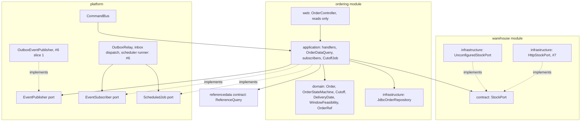

# Issue #8: Ordering module (`ordering` schema): plan

Written before code, per AGENTS.md "Issue Documents". What was actually built is in [WALKTHROUGH.md](WALKTHROUGH.md).

## Where `dev` stood

- Built for Ordering: the `ordering/contract/` package (`OrderCommands`, `OrderEvents`, `OrderQuery`, `OrderStatus`, `OrderViews`), the empty `ordering` schema and `waypoint_ordering` role (`migrations/20260930T1200_platform_module_schemas.sql`), and the catalogue rows `order:Place|Amend|Cancel|Read|CloseForDay`, all `implemented = false`.
- Inherited: `CommandBus` behind `POST /api/commands`, `ReferenceQuery.isOperating` / `nextOperatingDay`, `app.actor_has_outlet` / `app.actor_has_depot`, and `SetVehicleDayStatusHandler` as the handler pattern.
- Missing and needed at runtime:
  - No `EventPublisher` implementation, so nothing wrote `integration.outbox_events`.
  - No relay, consumer inbox or scheduler runner (#6).
  - No `StockPort` adapter (#7).
  - Row-level security treats a null actor as "no rows", so a subscriber or scheduled job with no user would see nothing.

## Which layer owns each dependency

Ordering depends only on abstractions. Each outside piece is a port owned by another layer, so the module is built and tested now and only runtime delivery waits on #6 and #7.

| Dependency | Owner | Resolution |
| --- | --- | --- |
| `EventPublisher` | platform, #6 | `OutboxEventPublisher` inserts into `integration.outbox_events` in the caller's transaction. It is the first checkbox of #6 and the real implementation. The relay, backoff and dead letter stay in #6 |
| Consumer inbox | platform, #6 | `integration.consumed_events (consumer, event_id)` created now so subscribers are idempotent from day one; the relay records into it |
| `EventSubscriber`, `ScheduledJob` | platform ports, #6 runs them | Ordering registers beans now. Tests call `on(envelope)` and `run(now)` directly under `waypoint_ordering` |
| `StockPort` | warehouse, #7 | Handlers take it by constructor. Tests use a fake. `UnconfiguredStockPort` answers `Unavailable` when `app.warehouse.api-key` is blank, as `WarehouseProperties` already specifies, so placement degrades visibly to `STOCK_UNKNOWN`. #7 adds `HttpStockPort` for the configured branch |
| System actor | platform | A fixed system principal, `app.actor_is_system()`, and `Database.asSystem`. Module RLS policies admit it, so subscribers and jobs see their own module's rows |
| Scope denial audit | platform | A scope check fails inside the transaction, so its audit row would roll back. `CommandBus` records a `FORBIDDEN` raised by a handler as a standalone denial after rollback |

## Decisions

1. **Order ref scheme.** `WPO-` plus 12 Crockford base32 characters of `sha256(actorId:commandId)`.
   - Deterministic per command, so a retry after a rollback, including a serialization retry of the whole transaction, reuses the same `orderRef` and the adapter reconciles by query (R-STK-11).
   - Cannot collide with dataset ids such as `ORD0091466`.
   - `order_id` is UUIDv7.
2. **Style and Tech cadence (R-ORD-03, R-ORD-04).** UI guidance only, not validation: there is no schedule data to validate against. Recorded as an assumption.
3. **Amend.**
   - Allowed only in `STOCK_UNKNOWN` or `CONFIRMED`, and only before `orders.closed` for that depot and day.
   - `ALLOCATED` and `DEFERRED` return a conflict naming ORD-05, because Planning holds them.
   - `LOADING` and later are rejected, naming ORD-06.
4. **Warehouse call against the transaction.** Call first, then persist, inside the bus transaction: validate, call `StockPort` with its 2 s budget, then insert.
   - No row lock is held during the call.
   - The deterministic `orderRef` makes a crash after reservation safe.
   - The alternative (persist `pending_reservation`, then call) needs two transactions and a status that is not in `OrderStatus`.
5. **Cancel** is refused from `LOADING` onward (ORD-10). The MODULES diagram is corrected to match.
6. **Mixed chilled and ambient** is rejected with R-ORD-06 and the client submits two orders. ORD-03 is updated from "split" to "rejected, client splits".

## Work breakdown

| Step | Content |
| --- | --- |
| 0 | This plan, `.gitignore` allow-list `!docs/issues/**/*.md`, the AGENTS.md "Issue Documents" section |
| 1 | Platform: `OutboxEventPublisher`, `integration.consumed_events`, system actor, and the bus's standalone audit of in-transaction scope denials |
| 2 | Warehouse: `UnconfiguredStockPort` |
| 3 | Domain, pure with the clock injected: `Order`, `OrderStateMachine`, `Cutoff`, `DeliveryDate`, `WindowFeasibility`, `OrderRef`, plus unit tests |
| 4 | Schema, `JdbcOrderRepository`, `OrderDataQuery`, and the read controller. Row-level security uses `FORCE`. The tables are `orders`, `order_lines`, `order_status_history` and `day_closures` |
| 5 | Handlers for Place, Amend, Cancel and CloseForDay; the catalogue flipped to `implemented = true` |
| 6 | Subscribers for every consumed event, and `CutoffJob` |
| 7 | WALKTHROUGH, EDGE-CASES, MODULES, ASSUMPTIONS and the development log |
