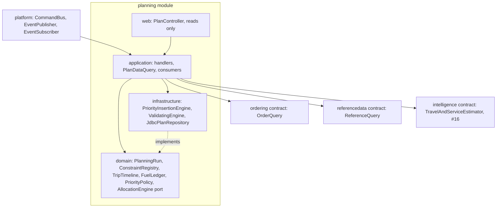

# Issue #9: Planning module (`planning` schema) — plan

Written before code, per AGENTS.md "Issue Documents". What was actually built goes in `WALKTHROUGH.md`.

## Progress (handoff)

Updated after every finished step. Branch `feat/planning-module` (stacked on `feat/ordering-module`). One commit per step: `feat(planning): ...`. Do not add co-author or tool trailers.

| Step | Status | How to find the commit | Notes |
| --- | --- | --- | --- |
| 0 Plan | **done** | `88d73d7` | This file |
| 1 CI and validator | **done** | `4aefd17` | `.github/workflows/ci.yml`; `tools/check_allocation/check_allocation.py` vendored unmodified. Frontend job is `typecheck` only |
| 2 Domain | **done** | `52ccaae` | `planning/domain/*`. 13 constraints. `PlanningRun` aggregate is **not** here; it belongs in step 5 |
| 3 Engine and S1 fixture | **done** | this step's commit | See "Step 3 result" below. Official validator: `FEASIBILITY: PASSED` |
| 4 Schema, repository, reads | **todo — start here** | | Next work. See "Resume at step 4" |
| 5 Generate, Override, Defer, Publish | todo | | After 4. Needs `PlanningRun` aggregate |
| 6 Revise, Replan, previews, consumers | todo | | After 5 |
| 7 Docs closeout | todo | | WALKTHROUGH, RULES, ASSUMPTIONS, EDGE-CASES, MODULES, development log |

**To resume:** read this table, then **"Resume at step 4"** if that row is still todo. Then the matching row in "Work breakdown" and the decision it cites. Copy Ordering patterns: `backend/src/main/java/com/waypoint/dispatch/ordering/` (handlers, `JdbcOrderRepository`, `OrderController`, `OrderDataQuery`), migration `migrations/20261001T0200_ordering_orders.sql`, tests `OrderingSchemaIntegrationTest`, `OrderingCommandIntegrationTest`, `OrderingTestConfig`.

**Environment notes.**
- Database tests need `TEST_DATABASE_URL` (dedicated, never equal to `DATABASE_URL`): `docker compose up -d db`, then `TEST_DATABASE_URL=... mvn test` from `backend/`.
- Python with pandas can segfault inside the agent sandbox; run `check_allocation.py` unsandboxed (`required_permissions: ["all"]`).
- Engine unit tests do **not** need a database. From `backend/`: `mvn -q -Dtest=PeakDayAllocationTest,ConstraintsTest,TripTimelineTest,PriorityPolicyTest test`.

### Step 3 result (do not re-do)

Files:
- `planning/infrastructure/PriorityInsertionEngine.java` — screen unservable, insert in `PriorityPolicy` order, cheapest feasible place, timeout → `R-PLN-ENGINE-TIMEOUT` + `partial`
- `planning/infrastructure/ValidatingEngine.java` — re-runs `PlanVerification`; throws `DomainException` + alert consumer (PLN-12)
- `planning/infrastructure/PeakDayScenario.java` — loads `data/` CSVs; writes Task 2B CSV (`unservable` exported as `deferred` for the official script)
- `src/test/.../planning/infrastructure/PeakDayAllocationTest.java` — writes `backend/target/task2b/submission_task2b.csv` (gitignored)

S1 on 2026-10-01, booklet `RuleSet` + default `PriorityPolicy`: **70 served, 14 deferred, 1 unservable**. All 10 `deferred_yesterday` orders served. Binding rules: `R-PLN-09`×5 (Fresh time), `R-PLN-07`×5 (trip count), `R-PLN-06`×4 (capacity; includes S1-078), `R-PLN-13`×1 (window). Overload S1-078 is `UNSERVABLE` / `R-PLN-06`. Same inputs → same CSV. Official `python tools/check_allocation/check_allocation.py backend/target/task2b/submission_task2b.csv` → **FEASIBILITY: PASSED**.

### Resume at step 4

**Goal.** Persist plans and serve reads. No commands yet (those are step 5). After this step a test can insert a draft/published run as `waypoint_planning` and query it through `PlanQuery`.

**Do, in this order:**

1. `migrations/20261001T0400_planning_plans.sql` (sorts after ordering's `T0300`). Schema and role already exist (`20260930T1200`). Tables from decision 8:
   - `planning.rule_sets` (`rule_set_id`, `effective_from`, `effective_to`, `note`)
   - `planning.rule_parameters` (`rule_set_id`, `parameter_key`, `parameter_value`, `unit`) — keys **must** match `RuleSet` constants (`fresh.budget.min`, …), not the old `ops.` names
   - `planning.policy_versions` (`policy_version_id`, `kind` = `deferral_priority`, `keys jsonb` ordered list, `depot_code` nullable for canary, `effective_from`/`to`, reject `effective_from` in the past at write time in the handler later)
   - `planning.runs` — `plan_id`, `depot_code`, `service_date`, `plan_version`, `row_version`, `status` (`draft`/`published`/`superseded`/`cancelled`), stamped `reference_version_id`, `rule_set_id`, `priority_policy_version_id`, `supersedes`, `demand_fingerprint`, `stale`, `partial`, `engine`, `published_at`, `published_by`
   - `planning.trips` — denormalize `depot_code`; trip number 1 or 2; brand, district, temperature, totals, planned minutes, departure, litres
   - `planning.allocations` — one row per order per run; decision, trip, sequence, planned arrival, binding rule, reason, `checks jsonb`
   - `planning.deferrals` — actor, reason, skip count (rule 8)
   - `planning.route_legs` — planned times only
   - `planning.fuel_usage` — litres for published non-superseded runs (decision 3)
   - RLS: `FORCE`; `app.actor_has_depot(depot_code) OR app.actor_is_system()` on every table (denormalize `depot_code` onto children). `GRANT SELECT, INSERT, UPDATE` (never DELETE) to `waypoint_planning`
   - Trigger: published run may only change `status` → `superseded` (plus `row_version`); deny insert/update on children unless parent is `draft`. Adapt `docs/architecture/schema/migrations/004_plan_provenance_and_immutability.sql` into the `planning` schema (that file is design-only, not applied)
   - Partial unique index: one `PUBLISHED` per `(depot_code, service_date)`
   - Seed booklet parameters and default priority keys (same as `RuleSet.bookletParameters()` and `PriorityPolicy.DEFAULT_KEYS`) with `effective_from` in the past so today's plans have a set. Need `btree_gist` if you add GiST exclusion on effective ranges
2. `planning/infrastructure/JdbcPlanRepository.java` — all writes `UPDATE ... WHERE plan_id = ? AND row_version = ?`, fail on 0 rows. Called only inside a bus transaction as `waypoint_planning`.
3. `planning/application/PlanDataQuery.java` implementing `PlanQuery`: `publishedPlan`, `draft`, `deferralsFor`, `fuelRemaining`. `previewAssignments` / `previewInterchange` can throw `UnsupportedOperationException` until step 6, **or** return empty — document which. Use `Database.readAs` so a contract read never switches the caller's role (Ordering's `OrderDataQuery` is the pattern).
4. `planning/web/PlanController.java` — reads only. Mutations stay on `POST /api/commands`. Authorize `plan:Read`.
5. Tests: `PlanningSchemaIntegrationTest` (copy `OrderingSchemaIntegrationTest`). Must prove: published run cannot be updated in place; second published for same depot-day fails the unique index; a dispatcher for the other depot sees nothing; missing `RuleSet` key refuses via `RuleSet.require` (POL-10) — can be a unit test if the seed is complete.

**Do not in step 4:** command handlers, `PlanningRun` mutations that publish events, catalogue `implemented=true`, consumers.

**After step 4:** commit `feat(planning): schema, repository and plan reads`, mark this table done, then step 5 (`PlanningRun` + Generate/Override/Defer/Publish).

**Known gaps already parked:**
- `PlanningRun` aggregate: step 5
- What-if / shadow policy: follow-up issue (decision 6)
- Optimiser behind `AllocationEngine`: follow-up
- `#16` predictor: `plannedWithoutPredictor = true` until then
- Dispatcher UI: issue #19

## Where the branch stands

`feat/planning-module` is stacked on `feat/ordering-module` and rebases onto `dev` once the Ordering PR merges.

- Built for Planning:
  - the `planning/contract/` package: `PlanViews`, `PlanQuery`, `PlanCommands`, `PlanEvents`;
  - the empty `planning` schema and the `waypoint_planning` role;
  - catalogue rows `plan:Generate|Override|Defer|Publish|Revise|Replan|Read`, all `implemented = false`;
  - the frontend mirror `frontend/src/shared/domain/planning.ts`.
- Inherited from #8: `OutboxEventPublisher`, `ConsumerInbox`, the system actor, `Database.readAs`, the `EventSubscriber` and `ScheduledJob` ports, and the bus auditing scope denials raised inside a transaction.
- Inputs Planning reads, all through contracts:
  - `OrderQuery.confirmedDemand(depot, day)`: order-level weight, volume and temperature, the deferral count and the original requested date;
  - `ReferenceQuery`: outlets with the effective window already intersected (R-PLN-29), available vehicles, travel profiles, service allowances and the calendar, each read at a stamped reference version.
- Already consuming Planning's events: Ordering's `OnPlanPublished`, `OnPlanRevised`, `OnOrderDeferred` and `OnOrderUnservable`, on the Ordering branch.
- There is no CI. The official validator is in the dataset bundle, not the repo. It checks R-PLN-01 to R-PLN-12 and the workshop rule only; **it does not check windows, fuel or one temperature per trip**, so those are ours to prove.

**The peak day (Task 2B, S1).** Every scenario order is at Peliyagoda: 85 orders, 28 of 38 vehicles available.

| Finding | Evidence | Consequence |
| --- | --- | --- |
| Chilled capacity binds first | 26 chilled Fresh orders, 181.6 m³. Available reefers are 3 trucks and 1 van: about 86 m³ per round, 172 m³ over two trips | Some chilled orders must defer. Priority decides which |
| One order fits no vehicle | 40.66 m³ against a 38 m³ largest available vehicle | `UNSERVABLE` (R-PLN-22), the `OVERLOAD-001` case |
| Van-only demand competes for 3 vans | 6 van-only orders; one available reefer van of 7 m³ | Van scarcity must be priced into vehicle choice |
| Time is binding far out | Puttalam is 173 min outbound, Kurunegala 127 | Far-district Fresh trips leave no second trip inside 270 min |

## Which layer owns each dependency

| Dependency | Owner | Resolution |
| --- | --- | --- |
| Demand | Ordering | `confirmedDemand` through `Database.readAs`, so the contract read never switches Planning's role. Never Ordering's tables |
| Outlets, fleet, travel, allowances | Reference data | Read at the reference version stamped on the run (POL-03, PLN-14) |
| Travel and service estimates | Intelligence, #16 | `TravelAndServiceEstimator` port; the default is the booklet's free-flow formula and allowances, and a plan built on it sets `plannedWithoutPredictor = true` |
| Allocation algorithm | Planning | `AllocationEngine` port in `domain`. This issue ships a deterministic engine; an optimiser replaces it later behind the same port and the same `ValidatingEngine` |
| Event delivery | Platform, #6 | Consumers are beans now; tests call `on(envelope)` directly as `waypoint_planning` |

## Decisions

### 1. Priority: a deterministic, versioned rule table now; an optimiser later

The dispatcher must be able to explain every deferral, so the first engine is a **lexicographic priority table**, not a weighted score: "deferred because it ranked 61st and no chilled vehicle had room" is explainable, "scored 0.43" is not. The table is a `planning.policy_versions` document, so reordering it is data, not a release.

Priority, highest first (R-PLN-21, revised):

| Rank | Key | Why |
| --- | --- | --- |
| 1 | Skipped on a prior run (`deferralCount >= P-12`, P-12 = 1) | R-PLN-20. An outlet deferred yesterday is tried first today |
| 2 | Fresh before Style and Tech | Stores open at 08:00; a missed Fresh run is a missed trading day |
| 3 | Chilled before ambient | Spoilage, and reefers are the scarcest resource |
| 4 | Strict access (`mall_dock`, or an effective window under P-17 minutes) | Fewest feasible slots; placed early or not at all |
| 5 | Scheduled cadence: days until the brand's next run (Style weekly, P-18) | Deferring a weekly order costs a week, a daily order costs a day |
| 6 | Earliest closing window | Tighter deadline first |
| 7 | Longest outbound distance | C-5 "longest distance first", **only as a tie-break**: windows win (R-PLN-25) |
| 8 | Largest volume | Big orders are hardest to place late |
| 9 | Days since the outlet was last served, then order id | Deterministic tie-break; days-since is computed from Planning's own served allocations |

Reproducibility is a requirement: same inputs and versions, same plan, byte for byte.

**The intelligent algorithm is a later engine, not a rewrite.** Improvement moves (relocate, swap, ejection chains; ALNS or OR-Tools routing) plug in behind `AllocationEngine`. `ValidatingEngine` re-checks whatever any engine returns, so a smarter engine can never publish an infeasible plan. The #16 predictor feeds `TravelAndServiceEstimator`, not the engine.

### 2. Trip timing follows the booklet: no return leg (A-26)

Trip time is the booklet formula exactly: outbound + inter-stop × (stops − 1) + allowances (R-PLN-08).

- **Departure.**
  - Fresh trip 1 leaves at 03:30 (P-06).
  - A vehicle's next trip leaves when its previous trip's last service ends, with **no return leg added**. This is the model behind the booklet's 101 + 112 = 213 example.
  - A daytime trip with no Fresh trip before it leaves at P-15 (08:00), or later if its first stop's window opens later.
- **Arrival.** Stop *k* arrives at the previous stop's service end plus the inter-stop minutes. It waits if early; it fails `DeliveryWindow` if it arrives after the effective close.
- **Waiting.** Waiting time counts toward the window check but not toward the 270 and 480 minute budgets, because the validator's budget is the formula alone.
- **Stop order.** Stops are sequenced by earliest effective close, then open, then order id (D-L). There are no coordinates, so inter-stop time is uniform within a district and distance cannot reorder stops.
- **Known cost.** Planned arrivals on a second trip are optimistic by the return drive. Recorded as A-26. Execution's actual times (#16 lateness) will show the gap.

### 3. Fuel (R-PLN-16, R-PLN-24, D-K)

- **Litres.** `(2 × depot_to_district_km + inter_stop_km × (stops − 1)) / km_per_l`. The return leg is included for fuel, never for time.
- **Weekly usage.** It sums `planning.fuel_usage` over the ISO week for **published, non-superseded** runs only (conflict B15 confirmed). A draft never consumes quota.
- **Over quota.** Allocation is blocked and the remaining litres are named in the reason (PLN-05).
- **Reported usage above quota** is an overrun with an alert, never clamped (FLT-05).

### 4. Constraints: one registry, four readers

Each constraint is a pure function `(TripCandidate, PlanContext) -> ConstraintResult(ruleId, passed, reason, slack)`. Its thresholds are read from the rule set, never compiled in; a missing parameter refuses the run (POL-10).

| Constraint | Rule | Slack unit |
| --- | --- | --- |
| `WeightCapacity`, `VolumeCapacity` | R-PLN-06, epsilon `1e-6` (P-08), order-level totals only | kg, m³ |
| `Temperature` | R-PLN-02, `frozen` as chilled (R-PLN-26) | none |
| `SingleTemperaturePerTrip` | R-PLN-31 (D-J) | none |
| `VanOnlyAccess` | R-PLN-03 | none |
| `HomeDepot` | R-PLN-04, FLT-04 | none |
| `SingleBrandDistrict` | R-PLN-01 | none |
| `WholeOrder` | R-PLN-05 | none |
| `VehicleAvailable` | R-FLT-03, the validator's workshop rule | none |
| `TripCount` | R-PLN-07, P-03 | trips |
| `TimeBudget` | R-PLN-09, R-PLN-10, R-PLN-11 | minutes |
| `DeliveryWindow` | R-PLN-13, R-PLN-14, R-PLN-15, R-PLN-29, R-PLN-30 | minutes to close |
| `FuelQuota` | R-PLN-16, R-PLN-24 | litres |

The engine, `plan:Override`, the publication gate and the UI (`checks` on every `AllocationView`) all call the same registry.

### 5. Engine: `PriorityInsertionEngine`, wrapped by `ValidatingEngine`

1. **Screen.** An order that fails capacity, temperature or access on **every** available vehicle, even an empty one, is `UNSERVABLE` with that rule (R-PLN-22, PLN-02, PLN-09). This is never a deferral.
2. **Insert in priority order.** For each order:
   - Evaluate every open trip it could join and every vehicle with a free trip slot.
   - Among the feasible candidates, pick the lowest cost. **Cost prices scarcity**: using a reefer for ambient, or a van for a truck-accessible outlet, costs more. Then best fit on remaining volume.
   - With no feasible candidate, `DEFERRED`. The **binding rule** is the first failing rule on the candidate with the fewest failures, taken in registry order. It is never a generic message.
3. **Time budget.** The engine takes a deadline (P-19). When it runs out, the remaining orders are deferred with `R-PLN-ENGINE-TIMEOUT` and the run is marked `partial` (PLN-11). It never returns an empty plan and never waits unbounded.
4. **Validation.** `ValidatingEngine` re-runs the registry over the whole result. Any failure throws before the result leaves the module, and raises an alert metric (PLN-12).

### 6. Policy rollout: versioned, stamped, and compared before promotion

Enterprise planning systems do not run hidden shadow policies. Oracle Transportation Management, for example, stamps each bulk plan with the parameter set it used, and runs **what-if plans that never commit**, compared side by side on KPIs. We adopt the same model:

- **Now.**
  - `policy_versions` and `rule_sets` are effective-dated and immutable.
  - A version with an effective date in the past is rejected (POL-05).
  - Every run stamps the reference, rule set and policy versions it used, so replay uses the stamped versions (POL-03).
  - Publication refuses if the current versions differ from the draft's (POL-02, PLN-14).
  - A policy version may be **scoped to one depot**, which is canary rollout without special machinery: the depot-scoped version wins over the global one, and the plan records which applied (POL-08).
- **Follow-up issue.** A what-if run (`plan:Generate` with a candidate policy, flagged never publishable) and a comparison query: served count, deferrals by rule, chilled m³ served, escalated outlets served, fuel. This replaces POL-06 and POL-07's shadow mode; divergence review stays a human decision.

### 7. Consumers never publish, except a feasible interchange

| Event | Planning does |
| --- | --- |
| `orders.closed` | Generates a draft as the system actor, so the dispatcher opens a ready plan. Never publishes |
| `order.placed`, `order.amended`, `order.cancelled` | Marks the depot-day draft `stale`. Publication would refuse anyway, because the demand fingerprint no longer matches (PLN-07). A cancel is located through Planning's own allocations, because `order.cancelled` carries no date |
| `reference.version_published`, `calendar.overridden` | Marks affected drafts stale. A published plan on a day that stopped operating raises an alert for the dispatcher |
| `vehicle.status_changed` to unavailable | If a published plan uses the vehicle that day: a revision **draft** that replans only that vehicle's trips (PLN-04, FLT-01), then an alert. The dispatcher publishes it |
| `loading.interchange_requested` | `ReplanTrip` as the system actor, on behalf of the loader. It tries the requested vehicle, then other available vehicles in cost order. It auto-publishes `plan.revised` **only** when exactly that trip changes and the whole registry passes; otherwise the trip defers as a unit (R-LOD-06, R-LOD-09, LOD-03). A loader at the dock cannot wait for a dispatcher |

### 8. Storage and immutability

- **Tables.**
  - `runs` carries status, plan and row versions, the three stamped versions, `supersedes`, `demand_fingerprint`, `stale`, `partial` and `engine`.
  - `trips` carries the vehicle, trip number, brand, district, temperature, totals, planned minutes, departure and litres.
  - `allocations` has one row per order per run, holding the decision, trip, sequence, planned arrival, binding rule, reason and the `checks` jsonb.
  - `deferrals` records the actor, reason and skip count (rule 8).
  - `route_legs` holds planned times only.
  - Also `fuel_usage`, `rule_sets`, `rule_parameters` and `policy_versions`.
- **Keys and RLS.** `depot_code` is denormalized onto every child table, so row-level security is one `app.actor_has_depot(depot_code) OR app.actor_is_system()` predicate with `FORCE`.
- **Published is immutable.** A trigger allows exactly one update on a published run, status to `SUPERSEDED`. It denies any insert or update on a child whose run is not `DRAFT`.
- **One current plan.** A partial unique index allows one `PUBLISHED` run per depot and day.
- **Seed data.** Rule parameters P-01 to P-19 and the first priority policy are seeded by migration, as the IAM policies are. They are policy configuration, not operational data.

### 9. The validator gates CI (PLN-17)

- The official `check_allocation.py` is vendored **unmodified** at `tools/check_allocation/`, with a `data` symlink to the repo's `data/`, because the script looks for `data/` beside itself.
- `PeakDayAllocationTest` runs the engine on the S1 fixture and writes `backend/target/task2b/submission_task2b.csv`. That file is also the Datathon Task 2B deliverable.
- `.github/workflows/ci.yml` starts PostgreSQL 16 and runs:
  - `mvn test` with `TEST_DATABASE_URL`;
  - the validator on the generated CSV;
  - frontend `npm ci`, `typecheck` and `test`.
- A rule regression fails the build.

## New and revised register entries

| Entry | Content |
| --- | --- |
| R-PLN-21 | Replaced by the table in decision 1 |
| P-12 | Escalation threshold = 1 |
| P-15 | Daytime trips earliest departure 08:00 |
| P-17 | Strict window threshold, 120 min |
| P-18 | Brand cadence days: Fresh 1, Style 7, Tech 1 |
| P-19 | Engine time budget, 10 s per depot-day |
| A-26 | Next trip departs at the previous trip's last service end, no return leg (booklet model) |
| A-27 | Reefers are not derated (A-02 stands, Q2 answered "no derating" for now) |
| C-2 | Closed as inert: depot is a function of district, `HomeDepot` covers it |

## Work breakdown

Each step is one commit, and the branch is one PR. Steps 1 to 5 are what the Hackathon demo and the Dispatcher UI (#19) need by 4 October; 6 and 7 follow.

| Step | Content | Tests |
| --- | --- | --- |
| 0 | This plan | none |
| 1 | CI workflow, vendored validator | CI green on the existing suite |
| 2 | Domain: model, `TripTimeline`, `FuelLedger`, the 13 constraints and `ConstraintRegistry`, `PriorityPolicy`, `RuleSet` | Per constraint: pass, fail and a slack assertion; the booklet's worked examples (101 and 213 min); the `1e-6` boundary; frozen; empty mall intersection |
| 3 | `PriorityInsertionEngine`, `ValidatingEngine`, S1 fixture loader and CSV export | Validator passes in CI; reproducibility; the 40.66 m³ order is unservable; every deferral names a rule; a timeout returns a partial result; an injected infeasible result is rejected |
| 4 | Migration (tables, RLS, immutability trigger, partial unique index, seeds), `JdbcPlanRepository`, `PlanDataQuery`, `PlanController` | A published plan cannot be updated in place; one published per depot-day; a missing rule parameter refuses the run |
| 5 | `plan:Generate`, `Override`, `Defer`, `Publish`; publication gate; events; catalogue flags | Every command through the bus; a dispatcher for another depot gets 403 plus audit; two overrides on one draft, the stale one rejected with a diff; publication refused when demand, reference or rules changed |
| 6 | `plan:Revise`, `Replan`, `previewInterchange`, `previewAssignments`, the consumers in decision 7 | Only affected trips change; an interchange with no substitute defers the trip as a unit; contract tests for `publishedPlan`, `previewInterchange` and every event payload |
| 7 | WALKTHROUGH, EDGE-CASES, RULES, ASSUMPTIONS, MODULES, development log | none |

## Out of scope, and who owns it

| Item | Owner |
| --- | --- |
| What-if runs and policy comparison (POL-06, POL-07) | Follow-up issue, decision 6 |
| Improvement search or optimiser behind `AllocationEngine` | Follow-up issue, with #16 |
| Learned travel and service times | #16 |
| Seeding a realistic delivery day for the judge walkthrough | The seed issue; the S1 fixture loader here is reusable |
| Dispatcher screens | #19 |
